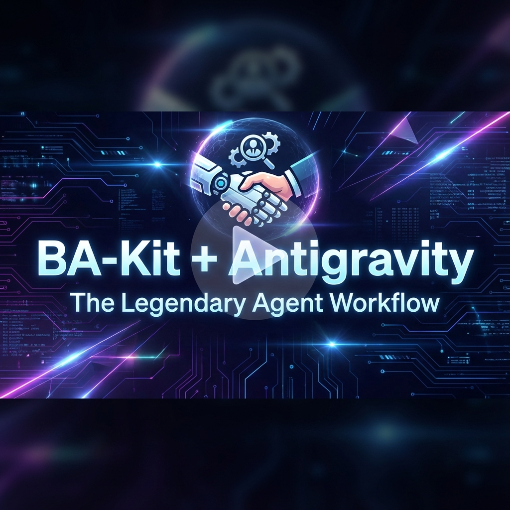

<p align="center">
  
</p>

<div align="center">

[**🇬🇧 English**](README.md) | [**🇻🇳 Tiếng Việt**](README.vi.md)

</div>

<p align="center">
  
  
  
  
</p>

<h1 align="center">🏆 BA-Kit</h1>
<h3 align="center">Thư viện Kỹ năng Requirements Engineering cho AI Agents</h3>

<p align="center">
  <strong>Biến mọi AI thành một Business Analyst Huyền thoại</strong><br>
  12 kỹ năng liên kết • 9 workflow thực thi • 4 template chuyên nghiệp
</p>

<br>

## 🎥 Video Hướng dẫn

<a href="#video-tutorial">
  
</a>

> *Xem cách biến AI của bạn thành chuyên gia Business Analyst sử dụng BA-Kit + Antigravity.*

---

## 🎯 BA-Kit là gì?

BA-Kit là một **thư viện prompt engineering** toàn diện giúp chuyển đổi các trợ lý AI thành những chuyên gia Business Analysis (BA). Bộ công cụ cung cấp:

- **12 Kỹ năng Chuyên nghiệp** bao phủ toàn bộ vòng đời requirements engineering
- **9 Workflow Thực thi** cho AI agents (tương thích Antigravity/Claude/GPT)
- **4 Template Chuyên nghiệp** (BRD, SRS, FRD, Agile Artifacts)
- **Tuân thủ Tiêu chuẩn** ISO 29148, ISO 25010, BABOK v3

Dù bạn đang xây dựng công cụ BA dựa trên AI hay muốn nâng cao thực hành requirements engineering của riêng mình, BA-Kit cung cấp khung kiến thức nền tảng mà bạn cần.

---

## 📊 Kiến trúc Kỹ năng

```
┌─────────────────────────────────────────────────────────────────────────────┐
│                          KIM TỰ THÁP KỸ NĂNG BA-KIT                         │
40: ├─────────────────────────────────────────────────────────────────────────────┤
│                                                                             │
│  🟢 TEMPLATES (Lớp Output)                                                  │
│  ┌───────────┐ ┌───────────┐ ┌───────────┐ ┌───────────┐                   │
│  │ SKILL-09  │ │ SKILL-10  │ │ SKILL-11  │ │ SKILL-12  │                   │
│  │    BRD    │ │    SRS    │ │    FRD    │ │   Agile   │                   │
│  └───────────┘ └───────────┘ └───────────┘ └───────────┘                   │
│                              │                                              │
│  🟡 SPECIALIZED (Lớp Ngữ cảnh)                                              │
│  ┌─────────┐ ┌─────────┐ ┌─────────┐ ┌─────────┐ ┌─────────┐               │
│  │SKILL-04 │ │SKILL-05 │ │SKILL-06 │ │SKILL-07 │ │SKILL-08 │               │
│  │   NFR   │ │Priority │ │Conflict │ │ Trace   │ │Validate │               │
│  │   NFR   │ │Ưu tiên  │ │Xung đột │ │Truy vết │ │Kiểm thử │               │
│  └─────────┘ └─────────┘ └─────────┘ └─────────┘ └─────────┘               │
│                              │                                              │
│  🔵 CORE (Lớp Nền tảng) ─ LUÔN KÍCH HOẠT                                    │
│  ┌─────────────────┐ ┌─────────────────┐ ┌─────────────────┐               │
│  │    SKILL-01     │ │    SKILL-02     │ │    SKILL-03     │               │
│  │    Indentity    │ │   Elicitation   │ │ Writing Quality │               │
│  │    Định danh    │ │   Khơi gợi      │ │ Chất lượng Viết │               │
│  └─────────────────┘ └─────────────────┘ └─────────────────┘               │
│                                                                             │
└─────────────────────────────────────────────────────────────────────────────┘
```

---

## 🚀 Hướng dẫn Nhanh

### Tích hợp cho AI Agent

1. **Copy các workflow** từ `.agent/workflows/` vào thư mục workflow của AI agent
2. **Tham chiếu AGENT.MD** như là system prompt hoặc persona
3. **Sử dụng slash commands** để kích hoạt kỹ năng cụ thể:

```
/ba-master        → Xem bản đồ workflow đầy đủ
/ba-identity      → Kích hoạt BA persona
/ba-elicitation   → Bắt đầu thu thập yêu cầu
/ba-writing       → Chế độ viết tài liệu chất lượng cao
/ba-nfr           → Đặc tả NFR (ISO 25010)
/ba-prioritization → MoSCoW, Kano, WSJF
/ba-conflict      → Giải quyết xung đột stakeholder
/ba-traceability  → RTM và quản lý thay đổi
/ba-validation    → Chế độ review yêu cầu
```

### Cho BA (Con người)

1. **Đọc USAGE-GUIDE.vi.md** để xem hướng dẫn sử dụng chi tiết
2. **Tham chiếu các file kỹ năng** trong thư mục `core/`, `specialized/`, `templates/`
3. **Sử dụng template** như điểm khởi đầu cho tài liệu của bạn

---

## 📁 Cấu trúc Repository

```
ba-kit/
│
├── AGENT.MD                    # 🏆 Master orchestrator - AI agent persona
├── USAGE-GUIDE.md              # 📘 Hướng dẫn sử dụng toàn diện (English)
├── USAGE-GUIDE.vi.md           # 📘 Hướng dẫn sử dụng toàn diện (Vietnamese)
├── 00-MASTER-INDEX.md          # 📋 Mục lục thư viện kỹ năng gốc
├── QUICK-START.md              # ⚡ Hướng dẫn tham khảo nhanh
├── README.md                   # 📄 File này (English)
├── README.vi.md                # 📄 File này (Vietnamese)
│
├── .agent/workflows/           # 🤖 Antigravity/AI Agent Workflows
│   ├── ba-master.md            #    Workflow điều hướng
│   ├── ba-identity.md          #    SKILL-01 workflow
│   ├── ba-elicitation.md       #    SKILL-02 workflow
│   ├── ba-writing.md           #    SKILL-03 workflow
│   ├── ba-nfr.md               #    SKILL-04 workflow
│   ├── ba-prioritization.md    #    SKILL-05 workflow
│   ├── ba-conflict.md          #    SKILL-06 workflow
│   ├── ba-traceability.md      #    SKILL-07 workflow
│   └── ba-validation.md        #    SKILL-08 workflow
│
├── core/                       # 🔵 Kỹ năng Cốt lõi (Luôn tải)
│   ├── SKILL-01-identity.md    #    BA persona & khung stakeholder
│   ├── SKILL-02-elicitation.md #    Kỹ thuật đặt câu hỏi & phỏng vấn
│   └── SKILL-03-writing-quality.md # Tiêu chuẩn viết yêu cầu
│
├── specialized/                # 🟡 Kỹ năng Chuyên sâu (Dựa trên ngữ cảnh)
│   ├── SKILL-04-nfr-framework.md    # ISO 25010 NFR templates
│   ├── SKILL-05-prioritization.md   # MoSCoW, Kano, WSJF...
│   ├── SKILL-06-conflict-resolution.md # Phương pháp đàm phán Harvard
│   ├── SKILL-07-traceability-change.md # RTM & kiểm soát thay đổi
│   └── SKILL-08-validation-verification.md # V&V checklists
│
└── templates/                  # 🟢 Mẫu Tài liệu
    ├── SKILL-09-brd-template.md     # Business Requirements Document
    ├── SKILL-10-srs-template.md     # SRS (IEEE 29148)
    ├── SKILL-11-frd-template.md     # Functional Requirements Document
    └── SKILL-12-agile-artifacts.md  # User Stories, Epics, Use Cases
```

---

## 🎓 12 Kỹ năng

### 🔵 Kỹ năng Cốt lõi (Core Skills)

| Skill | Tên | Mục đích |
|-------|-----|----------|
| **01** | Identity & Competencies | BA persona, bản đồ stakeholder, RACI |
| **02** | Elicitation & Questioning | Kỹ thuật phễu, 5W1H, cấu trúc phỏng vấn |
| **03** | Writing & Quality | Từ khóa RFC 2119, tiêu chuẩn INVEST, tiêu chí nghiệm thu |

### 🟡 Kỹ năng Chuyên sâu (Specialized Skills)

| Skill | Tên | Mục đích |
|-------|-----|----------|
| **04** | NFR Framework | Template ISO 25010 cho Hiệu năng, Bảo mật, Tin cậy |
| **05** | Prioritization | MoSCoW, Kano Model, WSJF, Value vs Effort |
| **06** | Conflict Resolution | Phương pháp Harvard, đàm phán nguyên tắc, quy trình leo thang |
| **07** | Traceability & Change | RTM, quy trình kiểm soát thay đổi, phân tích tác động |
| **08** | Validation & Verification | Thanh tra, rà soát (walkthroughs), quy trình ký duyệt |

### 🟢 Kỹ năng Template (Tạo Tài liệu)

| Skill | Tên | Mục đích |
|-------|-----|----------|
| **09** | BRD Template | Yêu cầu kinh doanh phê duyệt bởi lãnh đạo |
| **10** | SRS Template | Đặc tả yêu cầu phần mềm theo IEEE 29148 |
| **11** | FRD Template | Yêu cầu chức năng chi tiết |
| **12** | Agile Artifacts | User Stories, Epics, Use Cases, Story Mapping |

---

## 📜 Tuân thủ Tiêu chuẩn

BA-Kit tích hợp các thực hành tốt nhất từ:

| Tiêu chuẩn | Phạm vi |
|------------|---------|
| **ISO/IEC/IEEE 29148:2018** | Quy trình requirements engineering |
| **ISO/IEC 25010:2011** | Mô hình chất lượng hệ thống (SQuaRE) |
| **BABOK v3** | Business Analysis Body of Knowledge |
| **RFC 2119** | Từ khóa yêu cầu (SHALL/SHOULD/MAY) |
| **IREB CPRE** | Giáo trình requirements engineering |
| **SAFe/Agile** | User stories, ưu tiên WSJF |

---

## 🤖 Tích hợp AI Agent

### Antigravity (Google DeepMind)

Copy workflows vào `.agent/workflows/` trong dự án của bạn:

```bash
cp -r ba-kit/.agent/workflows/ your-project/.agent/workflows/
```

### Claude / ChatGPT / Khác

Sử dụng `AGENT.MD` làm system prompt hoặc tham chiếu trực tiếp các file kỹ năng trong prompt của bạn.

### Tích hợp Tùy chỉnh

Các file kỹ năng là Markdown thuần túy—có thể parse và tích hợp vào bất kỳ hệ thống AI nào.

---

## 📖 Ví dụ Sử dụng

### Ví dụ 1: Khám phá Dự án Mới

```
User: Tôi cần thu thập yêu cầu cho một nền tảng thương mại điện tử mới.

AI (với BA-Kit): 
/ba-identity → Lập bản đồ stakeholders (Product, IT, Marketing, Khách hàng)
/ba-elicitation → Áp dụng kỹ thuật đặt câu hỏi Phễu:
  - Khám phá: "Mục tiêu kinh doanh chính là gì?"
  - Làm rõ: "Khi bạn nói 'thanh toán nhanh', mục tiêu thời gian là bao nhiêu?"
  - Thăm dò: "Điều gì xảy ra nếu thanh toán thất bại giữa chừng?"
```

### Ví dụ 2: Giải quyết Xung đột

```
User: Sales muốn báo cáo thời gian thực nhưng IT nói không khả thi.

AI (với BA-Kit):
/ba-conflict → Áp dụng Phương pháp Harvard:
  - VỊ THẾ Sales: "Báo cáo thời gian thực"
  - LỢI ÍCH Sales: Cần dữ liệu hiện tại để ra quyết định nhanh
  - VỊ THẾ IT: "Xử lý theo lô (batch)"
  - LỢI ÍCH IT: Lo ngại về hiệu năng hệ thống
  
  LỰA CHỌN: Gần thời gian thực (5-phút), chiến lược cache, phân cấp ưu tiên
```

### Ví dụ 3: Review Yêu cầu

```
User: Review tài liệu SRS này và tìm lỗi chất lượng.

AI (với BA-Kit):
/ba-validation → Áp dụng checklist kiểm thử:
  ☐ Sử dụng đúng SHALL/SHOULD/MAY
  ☐ Không dùng từ ngữ mơ hồ ("nhanh", "thân thiện")
  ☐ Có tiêu chí nghiệm thu
  ☐ Truy vết được về nhu cầu kinh doanh
  
  LỖI TÌM THẤY:
  - FR-003: "phản hồi nhanh" → MƠ HỒ
  - FR-007: Thiếu tiêu chí nghiệm thu → KHÔNG ĐẦY ĐỦ
```

---

## 🤝 Đóng góp

Chúng tôi hoan nghênh mọi đóng góp! Hãy tự nhiên:

1. **Báo cáo vấn đề** - Tìm thấy lỗ hổng trong các kỹ năng?
2. **Đề xuất cải tiến** - Có kỹ thuật hay template tốt hơn?
3. **Thêm bản dịch** - Giúp BA-Kit đa ngôn ngữ hơn.
4. **Chia sẻ use cases** - Bạn đang sử dụng BA-Kit như thế nào?

---

## 📄 Giấy phép

Dự án này được cấp phép theo Giấy phép MIT - xem file [LICENSE](LICENSE) để biết chi tiết.

---

## 🙏 Lời cảm ơn

- **IIBA** - Khung kiến thức BABOK v3
- **IREB** - Giáo trình CPRE
- **ISO** - Các tiêu chuẩn 29148 và 25010
- **Harvard Negotiation Project** - Phương pháp đàm phán nguyên tắc
- **SAFe** - Khung Agile và WSJF

---

<p align="center">
  <strong>Xây dựng với 💜 cho Cộng đồng Requirements Engineering</strong><br>
  <em>Biến AI của bạn thành một Business Analyst Huyền thoại</em>
</p>

<p align="center">
  <a href="#-hướng-dẫn-nhanh">Bắt đầu Nhanh</a> •
  <a href="#-12-kỹ-năng">Kỹ năng</a> •
  <a href="#-tích-hợp-ai-agent">Tích hợp</a> •
  <a href="#-ví-dụ-sử-dụng">Ví dụ</a>
</p>
