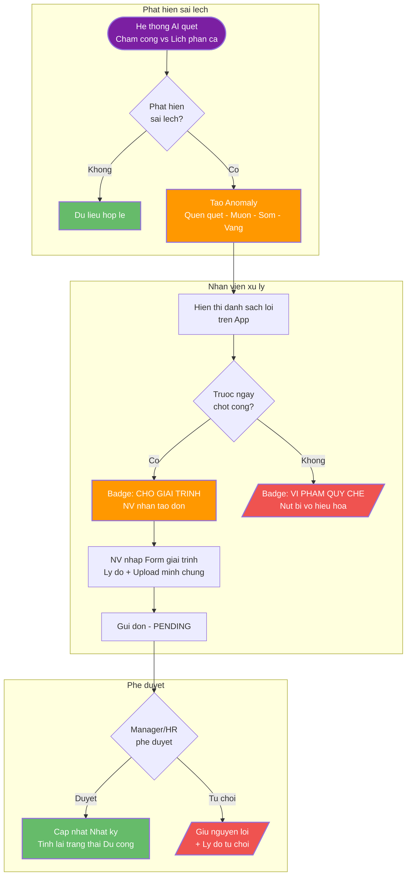
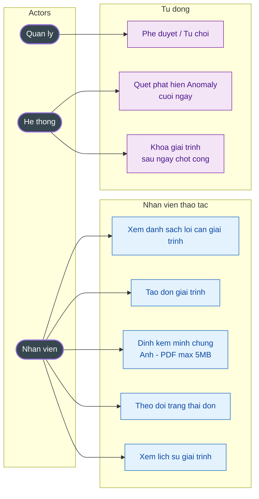

# 2.11.3. Giải trình công

---

| Thông tin | Nội dung |
| --- | --- |
| Target release | Release 1.0 |
| Epic | EPIC-03 – Quản lý sai lệch công |
| Document owner | ndthuy1 |
| Stakeholder | Nhân viên, Quản lý trực tiếp, HR |
| Status | Open |

---

### **1. MỤC TIÊU**

- **Lý do tồn tại:** Trong thực tế vận hành, việc chấm công bằng AI/Camera có thể phát sinh sai sót (Lỗi nhận diện, Quên quẹt thẻ, Đi muộn vì lý do khách quan).
- **Bài toán:** Cung cấp kênh chính thống để nhân viên tự đính chính dữ liệu giờ công kèm minh chứng (ảnh/tài liệu).
- **Giá trị mang lại:**    - Giảm 80% khối lượng công việc phản hồi thủ công của HR vào cuối tháng.
    - Tăng tính tương tác và hài lòng của nhân viên thông qua quy trình phê duyệt minh bạch.

### **2. MÔ TẢ QUY TRÌNH NGHIỆP VỤ (WORKFLOW)**

### **3. NHU CẦU NGƯỜI DÙNG**

| Persona | Nhu cầu cụ thể | Tài liệu / Căn cứ |
| --- | --- | --- |
| Nhân viên | Biết rõ mình đang bị lỗi ngày nào, giờ nào ngay tại màn hình "Lỗi chấm công cần giải trình". | List Anomaly |
| Nhân viên | Dễ dàng tải ảnh minh chứng để tăng tính thuyết phục cho đơn. | Upload Evidence |
| Quản lý | Theo dõi trạng thái của các đơn (Đang chờ/Đã duyệt/Từ chối) để không bỏ lỡ yêu cầu của cấp dưới. | Request Status |

---

### **4. USE CASE DIAGRAM**

### **5. PHẠM VI CHỨC NĂNG**

** **

| Mã | Chức năng | Mô tả chi tiết | User Story |
| --- | --- | --- | --- |
| F03.1 | List Lỗi cần giải trình | Hiển thị các block lỗi (Quên check-out, Vào muộn) được hệ thống AI tự động phát hiện. | Là NV, tôi muốn thấy lỗi của mình để giải trình kịp lúc. |
| F03.2 | Form Giải trình | Cho phép chọn Ngày, Lý do (Dropdown), nhập Nội dung văn bản. | Là NV, tôi muốn nhập lý do để giải thích rõ sự việc. |
| F03.3 | Đính kèm minh chứng | Vùng kéo thả file để upload bằng chứng thực tế. | Là NV, tôi muốn đính kèm ảnh để tăng độ tin cậy của đơn. |
| F03.4 | Trạng thái yêu cầu | Các Badge (Đã duyệt, Đang chờ, Từ chối) hiển thị tại cụm "Yêu cầu gần đây". | Là NV, tôi muốn theo dõi tiến độ duyệt đơn để yên tâm về ngày công. |
| F03.5 | Xem tất cả | Link chuyển hướng xem toàn bộ lịch sử giải trình trong quá khứ. | Là NV, tôi muốn xem lại các đơn cũ để đối soát lương cuối tháng. |

---

### **6. YÊU CẦU PHI CHỨC NĂNG**

1. **Dung lượng File**: Hỗ trợ upload ảnh (.jpg, .png) và tài liệu (.pdf) không quá 5MB.
2. **Tính tích hợp**: Sau khi đơn được duyệt, dữ liệu mốc giờ công màn Nhật ký phải được cập nhật **Real-time**.
3. **Bảo mật**: Chỉ có Quản lý của phòng ban đó mới thấy được nội dung giải trình và minh chứng của nhân viên cấp dưới.

---

### **7. ĐIỀU KIỆN GIẢ ĐỊNH (PRE-CONDITION)**

1. Nhân viên đã được định danh và gán Ca làm việc.
2. Hệ thống AI đã ghi nhận dữ liệu chấm công thực tế để làm căn cứ so sánh lỗi.
