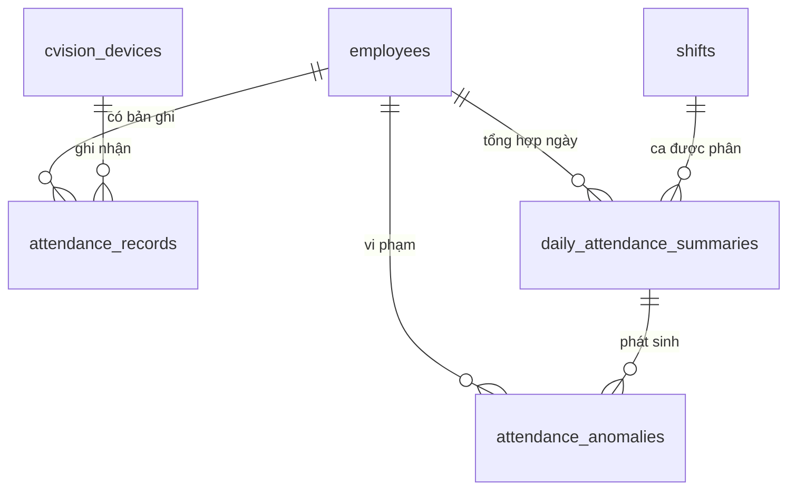

# Database Schema — M01: Chấm Công

## Tables

### attendance_records
| Column | Type | Nullable | Default | Description |
|--------|------|----------|---------|-------------|
| id | UUID | No | gen_random_uuid() | PK |
| tenant_id | UUID | No | | FK → tenants |
| employee_id | UUID | No | | FK → employees |
| site_id | UUID | No | | FK → sites |
| record_type | VARCHAR(10) | No | | CHECK_IN / CHECK_OUT |
| recorded_at | TIMESTAMPTZ | No | | Thời điểm chấm công |
| source | VARCHAR(20) | No | | CVISION / MANUAL |
| status | VARCHAR(20) | No | 'PENDING' | APPROVED / PENDING / REJECTED |
| confidence_score | NUMERIC(4,3) | Yes | | Độ tin cậy C-Vision (0–1) |
| cvision_event_id | VARCHAR(100) | Yes | | ID webhook từ C-Vision (idempotency) |
| device_id | UUID | Yes | | FK → cvision_devices |
| manual_reason | TEXT | Yes | | Lý do nhập thủ công |
| created_by | UUID | Yes | | FK → employees (HR/Manager nếu MANUAL) |
| created_at | TIMESTAMPTZ | No | now() | |

### daily_attendance_summaries
| Column | Type | Nullable | Default | Description |
|--------|------|----------|---------|-------------|
| id | UUID | No | gen_random_uuid() | PK |
| tenant_id | UUID | No | | FK → tenants |
| employee_id | UUID | No | | FK → employees |
| site_id | UUID | No | | FK → sites |
| work_date | DATE | No | | Ngày làm việc |
| shift_id | UUID | Yes | | FK → shifts (ca được phân) |
| first_checkin_at | TIMESTAMPTZ | Yes | | Check-in đầu tiên |
| last_checkout_at | TIMESTAMPTZ | Yes | | Check-out cuối cùng |
| gross_hours | NUMERIC(5,2) | No | 0 | Tổng giờ (CheckOut - CheckIn) |
| break_hours | NUMERIC(5,2) | No | 0 | Giờ nghỉ không lương |
| net_hours | NUMERIC(5,2) | No | 0 | gross_hours - break_hours |
| regular_hours | NUMERIC(5,2) | No | 0 | Giờ làm trong tiêu chuẩn |
| overtime_hours | NUMERIC(5,2) | No | 0 | Giờ tăng ca |
| night_hours | NUMERIC(5,2) | No | 0 | Giờ làm ban đêm (22:00–06:00) |
| late_minutes | SMALLINT | No | 0 | Số phút đi trễ |
| early_leave_minutes | SMALLINT | No | 0 | Số phút về sớm |
| status | VARCHAR(20) | No | 'ABSENT' | PRESENT / LATE / EARLY_LEAVE / LATE_AND_EARLY / ABSENT / ON_LEAVE / HOLIDAY / WEEKEND |
| updated_at | TIMESTAMPTZ | No | now() | |

### attendance_anomalies
| Column | Type | Nullable | Default | Description |
|--------|------|----------|---------|-------------|
| id | UUID | No | gen_random_uuid() | PK |
| tenant_id | UUID | No | | FK → tenants |
| employee_id | UUID | No | | FK → employees |
| work_date | DATE | No | | Ngày vi phạm |
| anomaly_type | VARCHAR(20) | No | | LATE / EARLY / MISSING_CHECKOUT / ABSENT |
| detail | JSONB | No | '{}' | Chi tiết (số phút, ca liên quan) |
| is_resolved | BOOLEAN | No | false | Đã giải trình/xử lý chưa |
| resolved_by | UUID | Yes | | FK → employees |
| resolved_at | TIMESTAMPTZ | Yes | | |
| created_at | TIMESTAMPTZ | No | now() | |

### Indexes
| Name | Columns | Type |
|------|---------|------|
| idx_att_rec_emp_date | (tenant_id, employee_id, recorded_at) | BTREE |
| idx_att_rec_cvision_event | (tenant_id, cvision_event_id) | UNIQUE WHERE cvision_event_id IS NOT NULL |
| idx_att_rec_status | (tenant_id, status) WHERE status='PENDING' | PARTIAL |
| idx_daily_summary_emp_date | (tenant_id, employee_id, work_date) | UNIQUE |
| idx_daily_summary_date | (tenant_id, site_id, work_date) | BTREE |
| idx_anomalies_unresolved | (tenant_id, employee_id) WHERE is_resolved=false | PARTIAL |

### Constraints
| Name | Type | Detail |
|------|------|--------|
| chk_record_type | CHECK | record_type IN ('CHECK_IN','CHECK_OUT') |
| chk_source | CHECK | source IN ('CVISION','MANUAL') |
| chk_att_status | CHECK | status IN ('APPROVED','PENDING','REJECTED') |
| chk_daily_status | CHECK | status IN ('PRESENT','LATE','EARLY_LEAVE','LATE_AND_EARLY','ABSENT','ON_LEAVE','HOLIDAY','WEEKEND') |
| uq_daily_summary | UNIQUE | daily_attendance_summaries(tenant_id, employee_id, work_date) |

## Relationships

