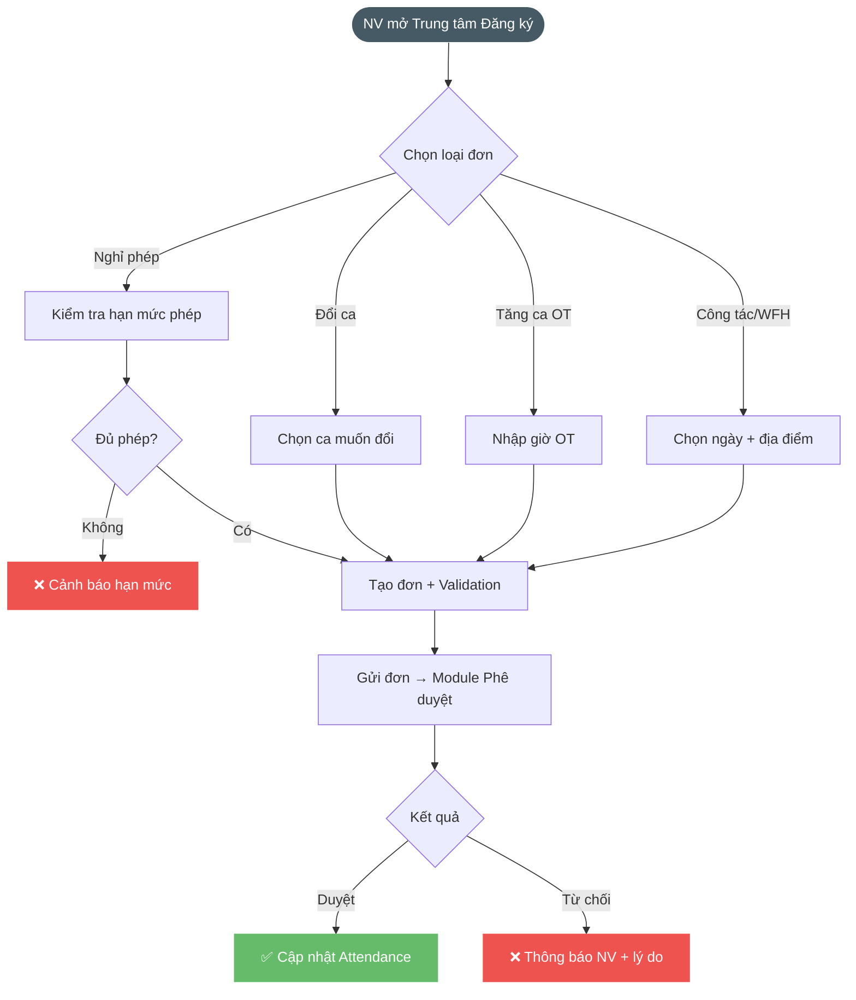

# 2.11.4. Trung tâm đăng ký

---

| Thông tin | Nội dung |
| --- | --- |
| Target release | Version 1.0 (Sprint 9) |
| Epic | STRATOS-ESS: Trải nghiệm dành cho Nhân viên |
| Document owner | BA Team |
| Stakeholder | Nhân viên, Quản lý, HR Admin |
| Status | Draft |
| Tham chiếu | EAMS v2.0 §5 (Tăng ca), §6 (Nghỉ phép) |

---

### **1. MỤC TIÊU**

- **Lý do tồn tại:** Nhân viên cần kênh chính thức để đăng ký nghỉ phép, đổi ca, tăng ca (OT) trực tiếp trên ứng dụng thay vì gửi đơn giấy hoặc email.
- **Bài toán:** Số hóa toàn bộ luồng đơn từ, tự động kiểm tra hạn mức phép, xung đột lịch và giới hạn OT theo Luật Lao động VN.
- **Giá trị mang lại:** Giảm 80% thời gian xử lý đơn thủ công cho HR; tăng minh bạch với trạng thái đơn real-time cho NV.

---

### **2. MÔ TẢ QUY TRÌNH NGHIỆP VỤ**




```
NV mở Trung tâm đăng ký trên Mini App
        ↓
Chọn loại đơn: Nghỉ phép | Đổi ca | Tăng ca (OT)
        ↓
Điền form: Ngày, thời gian, lý do, đính kèm (nếu cần)
        ↓
Hệ thống validate:
  ├─ Kiểm tra hạn mức phép (pessimistic lock)
  ├─ Kiểm tra trùng ngày/giờ (DB exclusion constraint)
  ├─ Kiểm tra giới hạn OT (ngày/tuần/tháng/năm)
  └─ Kiểm tra xung đột ca
        ↓
  ├─ Không hợp lệ → Hiển thị lỗi cụ thể
  └─ Hợp lệ → Tạo đơn (PENDING) → Gửi phê duyệt
        ↓
NV theo dõi trạng thái đơn tại "Đơn từ của tôi"
```

---

### **3. NHU CẦU NGƯỜI DÙNG**

| Persona | Nhu cầu cụ thể | Tài liệu / Căn cứ |
| --- | --- | --- |
| Nhân viên | Muốn gửi đơn nghỉ phép nhanh trên điện thoại và biết ngay hạn mức phép còn lại. | Form nghỉ phép |
| Nhân viên | Muốn đăng ký đổi ca khi có việc đột xuất mà không cần liên hệ HR. | Form đổi ca |
| Nhân viên | Muốn đăng ký OT trước hoặc sau khi làm thêm để đảm bảo giờ OT được ghi nhận. | Form tăng ca |
| Nhân viên | Muốn theo dõi tiến độ duyệt đơn để yên tâm về quyền lợi. | Danh sách đơn từ |

---

### **4. PHẠM VI CHỨC NĂNG**

| Mã | Chức năng | Mô tả chi tiết | User Story |
| --- | --- | --- | --- |
| F04.1 | Đăng ký nghỉ phép | Form chọn loại phép (8 loại), ngày bắt đầu/kết thúc, nửa ngày AM/PM, lý do, đính kèm. Hiển thị hạn mức phép còn lại. Chặn trùng ngày. | [US-REG-01](./us-reg-01-dang-ky-nghe-phep.md) |
| F04.2 | Đăng ký đổi ca | Form chọn ngày cần đổi, ca hiện tại (tự điền), ca mong muốn. Kiểm tra xung đột lịch. | [US-REG-02](./us-reg-02-dang-ky-doi-ca.md) |
| F04.3 | Đăng ký tăng ca (OT) | Form chọn ngày, mốc giờ bắt đầu/kết thúc OT, lý do. Kiểm tra giới hạn OT theo luật. Hỗ trợ đăng ký trước (PRE) và sau (POST). | [US-REG-03](./us-reg-03-dang-ky-tang-ca.md) |
| F04.4 | Theo dõi trạng thái đơn & hạn mức | Danh sách đơn đã gửi kèm Badge trạng thái (Pending/Approved/Rejected). Xem hạn mức phép năm, OT lũy kế. Cho phép hủy đơn đang Pending. | [US-REG-04](./us-reg-04-theo-doi-don-tu-va-han-muc.md) |
| F04.5 | Cấu hình chính sách phép năm | HR cấu hình phép cơ bản, thâm niên, carryover, pro-rata. Batch recalculate balance. | [US-REG-05](./us-reg-05-cau-hinh-chinh-sach-phep-nam.md) |
| F04.6 | Đăng ký Công tác & WFH | Form đăng ký Business Travel (multi-day, địa điểm) và WFH (hạn mức tuần). Auto-mark PRESENT. Tích hợp Dashboard hiện diện. | [US-REG-06](./us-reg-06-dang-ky-cong-tac-va-wfh.md) |

---

### **5. LOẠI NGHỈ PHÉP** *(Nguồn: EAMS v2.0 §6.1)*

| Loại | Ngày/năm | Trả lương | Cần file đính kèm | Báo trước |
| --- | --- | --- | --- | --- |
| ANNUAL (Phép năm) | 12 | Có | Không | 3 ngày |
| SICK (Ốm) | 30 | Có | Có | — |
| MATERNITY (Thai sản) | 180 | Có | Có | 30 ngày |
| PATERNITY (Cha) | 7 | Có | Có | — |
| MARRIAGE (Kết hôn) | 3 | Có | Không | — |
| BEREAVEMENT (Tang) | 3 | Có | Không | — |
| UNPAID (Không lương) | Tùy chỉnh | Không | Không | — |
| COMPENSATORY (Bù) | Tùy chỉnh | Có | Không | — |

---

### **6. GIỚI HẠN TĂNG CA** *(Nguồn: EAMS v2.0 §5.2 — Nghị định 13/2023)*

| Chu kỳ | Giới hạn mặc định | Cảnh báo tại |
| --- | --- | --- |
| Ngày | 4 giờ | ≥ 3 giờ |
| Tuần | 12 giờ | ≥ 10 giờ |
| Tháng | 40 giờ | ≥ 32 giờ |
| Năm | 200 giờ (300 đặc biệt) | ≥ 160 giờ |

---

### **7. YÊU CẦU PHI CHỨC NĂNG**

- **Ràng buộc dữ liệu:** Chặn đăng ký trùng ngày/giờ (DB exclusion constraint); chặn xóa đơn đã Approved.
- **Hiệu năng:** Kiểm tra hạn mức phép < 0.5 giây; submit form < 1 giây.
- **Thông báo:** Push notification khi trạng thái đơn thay đổi (Approved/Rejected).
- **Bảo mật:** NV chỉ xem/sửa đơn của chính mình; Manager chỉ duyệt đơn team mình.

---

### **8. ĐIỀU KIỆN GIẢ ĐỊNH**

1. Nhân viên đã được gán ca làm việc hợp lệ (Module 02).
2. Hệ thống đã khởi tạo hạn mức phép năm cho nhân viên (LeaveBalanceService).
3. Cấu hình phê duyệt đã được thiết lập cho chi nhánh (Module 10).
