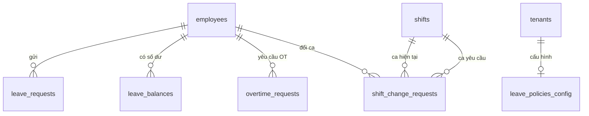

# Database Schema — M04: Trung Tâm Đăng Ký

## Tables

### leave_requests
| Column | Type | Nullable | Default | Description |
|--------|------|----------|---------|-------------|
| id | UUID | No | gen_random_uuid() | PK |
| tenant_id | UUID | No | | FK → tenants |
| employee_id | UUID | No | | FK → employees |
| site_id | UUID | No | | FK → sites |
| leave_type | VARCHAR(20) | No | | ANNUAL / SICK / MATERNITY / PATERNITY / MARRIAGE / BEREAVEMENT / UNPAID / COMPENSATORY |
| start_date | DATE | No | | Ngày bắt đầu nghỉ |
| end_date | DATE | No | | Ngày kết thúc nghỉ |
| half_day | VARCHAR(5) | Yes | | AM / PM (nếu nghỉ nửa ngày) |
| working_days | NUMERIC(5,1) | No | | Số ngày làm việc thực tế |
| reason | TEXT | No | | Lý do nghỉ |
| status | VARCHAR(20) | No | 'PENDING' | PENDING / APPROVED / REJECTED / CANCELLED |
| created_at | TIMESTAMPTZ | No | now() | |
| updated_at | TIMESTAMPTZ | No | now() | |

### leave_balances
| Column | Type | Nullable | Default | Description |
|--------|------|----------|---------|-------------|
| id | UUID | No | gen_random_uuid() | PK |
| tenant_id | UUID | No | | FK → tenants |
| employee_id | UUID | No | | FK → employees |
| year | SMALLINT | No | | Năm áp dụng |
| leave_type | VARCHAR(20) | No | | Loại phép |
| entitled | NUMERIC(5,1) | No | 0 | Tổng ngày được hưởng |
| used | NUMERIC(5,1) | No | 0 | Đã sử dụng |
| pending | NUMERIC(5,1) | No | 0 | Đang chờ duyệt |
| carryover | NUMERIC(5,1) | No | 0 | Số ngày chuyển từ năm trước |
| carryover_expiry | DATE | Yes | | Hạn dùng ngày carryover |
| updated_at | TIMESTAMPTZ | No | now() | |

### shift_change_requests
| Column | Type | Nullable | Default | Description |
|--------|------|----------|---------|-------------|
| id | UUID | No | gen_random_uuid() | PK |
| tenant_id | UUID | No | | FK → tenants |
| employee_id | UUID | No | | FK → employees |
| work_date | DATE | No | | Ngày cần đổi ca |
| current_shift_id | UUID | No | | FK → shifts (ca hiện tại) |
| requested_shift_id | UUID | No | | FK → shifts (ca muốn đổi) |
| reason | TEXT | No | | Lý do đổi ca |
| status | VARCHAR(20) | No | 'PENDING' | PENDING / APPROVED / REJECTED / CANCELLED |
| created_at | TIMESTAMPTZ | No | now() | |

### overtime_requests
| Column | Type | Nullable | Default | Description |
|--------|------|----------|---------|-------------|
| id | UUID | No | gen_random_uuid() | PK |
| tenant_id | UUID | No | | FK → tenants |
| employee_id | UUID | No | | FK → employees |
| site_id | UUID | No | | FK → sites |
| ot_date | DATE | No | | Ngày tăng ca |
| start_time | TIMESTAMPTZ | No | | Thời điểm bắt đầu OT |
| end_time | TIMESTAMPTZ | No | | Thời điểm kết thúc OT |
| ot_hours | NUMERIC(4,2) | No | | Số giờ OT yêu cầu |
| day_type | VARCHAR(10) | No | | WEEKDAY / WEEKEND / HOLIDAY |
| multiplier | NUMERIC(3,1) | No | | Hệ số: 1.5 / 2.0 / 3.0 |
| source | VARCHAR(20) | No | | PRE_APPROVED / POST_APPROVED / AUTO_DETECTED |
| reason | TEXT | Yes | | Lý do tăng ca |
| status | VARCHAR(20) | No | 'PENDING' | PENDING / APPROVED / REJECTED / CANCELLED |
| created_at | TIMESTAMPTZ | No | now() | |

### leave_policies_config
| Column | Type | Nullable | Default | Description |
|--------|------|----------|---------|-------------|
| id | UUID | No | gen_random_uuid() | PK |
| tenant_id | UUID | No | | FK → tenants |
| base_entitlement | SMALLINT | No | 12 | Ngày phép năm cơ bản |
| seniority_bonus_years | SMALLINT | No | 5 | Cứ N năm được cộng thêm |
| seniority_bonus_days | SMALLINT | No | 1 | Số ngày cộng thêm mỗi mốc |
| carryover_max | NUMERIC(4,1) | No | 5 | Tối đa ngày chuyển tiếp |
| carryover_expiry_month | SMALLINT | No | 3 | Tháng hết hạn carryover (3 = 31/03) |
| pro_rata_method | VARCHAR(20) | No | 'MONTHLY' | MONTHLY / NONE |
| half_day_allowed | BOOLEAN | No | true | Cho phép nghỉ nửa ngày |
| updated_by | UUID | Yes | | FK → employees |
| updated_at | TIMESTAMPTZ | No | now() | |

### Indexes
| Name | Columns | Type |
|------|---------|------|
| idx_leave_req_emp_status | (tenant_id, employee_id, status) | BTREE |
| idx_leave_req_daterange | (tenant_id, employee_id, start_date, end_date) | BTREE |
| idx_leave_bal_emp_year | (tenant_id, employee_id, year, leave_type) | UNIQUE |
| idx_ot_req_emp_date | (tenant_id, employee_id, ot_date) | BTREE |
| idx_ot_req_active_per_day | (tenant_id, employee_id, ot_date) WHERE status IN ('PENDING','APPROVED') | UNIQUE PARTIAL |

### Constraints
| Name | Type | Detail |
|------|------|--------|
| chk_leave_type | CHECK | leave_type IN ('ANNUAL','SICK','MATERNITY','PATERNITY','MARRIAGE','BEREAVEMENT','UNPAID','COMPENSATORY') |
| chk_leave_status | CHECK | status IN ('PENDING','APPROVED','REJECTED','CANCELLED') |
| chk_day_type | CHECK | day_type IN ('WEEKDAY','WEEKEND','HOLIDAY') |
| excl_leave_overlap | EXCLUDE USING GIST | leave_requests: (employee_id WITH =, daterange(start_date,end_date,'[]') WITH &&) WHERE status NOT IN ('REJECTED','CANCELLED') |
| uq_ot_active_per_day | UNIQUE (partial) | overtime_requests(tenant_id, employee_id, ot_date) WHERE status IN ('PENDING','APPROVED') |

## Relationships

