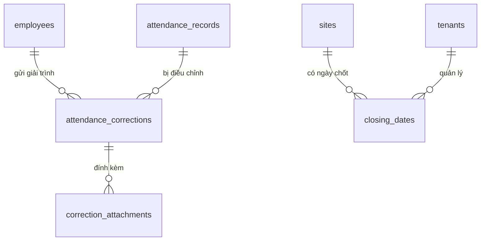

# Database Schema — M03: Giải Trình Chấm Công

## Tables

### attendance_corrections
| Column | Type | Nullable | Default | Description |
|--------|------|----------|---------|-------------|
| id | UUID | No | gen_random_uuid() | PK |
| tenant_id | UUID | No | | FK → tenants |
| employee_id | UUID | No | | FK → employees |
| site_id | UUID | No | | FK → sites |
| work_date | DATE | No | | Ngày cần điều chỉnh |
| correction_type | VARCHAR(10) | No | | ADD / MODIFY / DELETE |
| target_record_id | UUID | Yes | | FK → attendance_records (MODIFY/DELETE) |
| proposed_type | VARCHAR(10) | Yes | | CHECK_IN / CHECK_OUT (ADD/MODIFY) |
| proposed_time | TIMESTAMPTZ | Yes | | Thời gian đề xuất (ADD/MODIFY) |
| reason | TEXT | No | | Lý do giải trình |
| status | VARCHAR(20) | No | 'PENDING' | PENDING / APPROVED / REJECTED / CANCELLED |
| applied_at | TIMESTAMPTZ | Yes | | Thời điểm áp dụng sau duyệt |
| created_at | TIMESTAMPTZ | No | now() | |
| updated_at | TIMESTAMPTZ | No | now() | |

### correction_attachments
| Column | Type | Nullable | Default | Description |
|--------|------|----------|---------|-------------|
| id | UUID | No | gen_random_uuid() | PK |
| tenant_id | UUID | No | | FK → tenants |
| correction_id | UUID | No | | FK → attendance_corrections |
| file_name | VARCHAR(255) | No | | Tên file gốc |
| file_url | TEXT | No | | URL lưu trữ (S3/CDN) |
| file_size_bytes | INTEGER | Yes | | Kích thước file |
| mime_type | VARCHAR(100) | Yes | | Loại MIME |
| uploaded_at | TIMESTAMPTZ | No | now() | |

### closing_dates
| Column | Type | Nullable | Default | Description |
|--------|------|----------|---------|-------------|
| id | UUID | No | gen_random_uuid() | PK |
| tenant_id | UUID | No | | FK → tenants |
| site_id | UUID | No | | FK → sites |
| period_year | SMALLINT | No | | Năm của kỳ |
| period_month | SMALLINT | No | | Tháng của kỳ (1–12) |
| closing_day | SMALLINT | No | 25 | Ngày chốt công (1–28) |
| effective_close_date | DATE | No | | Ngày chốt thực tế (sau xử lý T7/CN) |
| grace_days | SMALLINT | No | 3 | Số ngày buffer sau chốt |
| is_locked | BOOLEAN | No | false | Đã khóa dữ liệu chưa |
| locked_at | TIMESTAMPTZ | Yes | | Thời điểm khóa |
| locked_by | UUID | Yes | | FK → employees (GLOBAL_HR/SYS_ADMIN) |
| unlock_reason | TEXT | Yes | | Lý do mở khóa ngoại lệ |

### Indexes
| Name | Columns | Type |
|------|---------|------|
| idx_correction_emp_date | (tenant_id, employee_id, work_date) | BTREE |
| idx_correction_status | (tenant_id, status) WHERE status='PENDING' | PARTIAL |
| idx_correction_attach | correction_id | BTREE |
| idx_closing_site_period | (tenant_id, site_id, period_year, period_month) | UNIQUE |

### Constraints
| Name | Type | Detail |
|------|------|--------|
| chk_correction_type | CHECK | correction_type IN ('ADD','MODIFY','DELETE') |
| chk_correction_status | CHECK | status IN ('PENDING','APPROVED','REJECTED','CANCELLED') |
| chk_period_month | CHECK | period_month BETWEEN 1 AND 12 |
| chk_closing_day | CHECK | closing_day BETWEEN 1 AND 28 |
| uq_closing_site_period | UNIQUE | closing_dates(tenant_id, site_id, period_year, period_month) |

## Relationships

