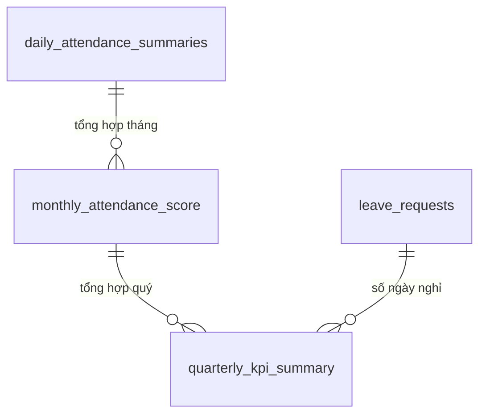

# Database Schema — M05: Báo Cáo Cá Nhân

> Module này không tạo bảng mới. Mọi dữ liệu đọc từ các module upstream
> thông qua materialized views và views được làm mới định kỳ.

## Materialized Views

### monthly_attendance_score
```sql
CREATE MATERIALIZED VIEW monthly_attendance_score AS
SELECT
    das.tenant_id,
    das.employee_id,
    DATE_TRUNC('month', das.work_date)::DATE          AS period_month,
    COUNT(*) FILTER (WHERE das.status NOT IN ('WEEKEND','HOLIDAY'))
                                                       AS total_working_days,
    COUNT(*) FILTER (WHERE das.status = 'PRESENT')    AS on_time_days,
    COUNT(*) FILTER (WHERE das.status IN ('LATE','LATE_AND_EARLY'))
                                                       AS late_days,
    COUNT(*) FILTER (WHERE das.status IN ('EARLY_LEAVE','LATE_AND_EARLY'))
                                                       AS early_leave_days,
    COUNT(*) FILTER (WHERE das.status = 'ABSENT')     AS absent_days,
    SUM(das.net_hours)                                 AS total_net_hours,
    SUM(das.overtime_hours)                            AS total_ot_hours,
    SUM(das.late_minutes)                              AS total_late_minutes,
    ROUND(
        COUNT(*) FILTER (WHERE das.status = 'PRESENT')::NUMERIC
        / NULLIF(COUNT(*) FILTER (WHERE das.status NOT IN ('WEEKEND','HOLIDAY','ON_LEAVE')), 0)
        * 100, 2
    )                                                  AS attendance_score
FROM daily_attendance_summaries das
GROUP BY das.tenant_id, das.employee_id, DATE_TRUNC('month', das.work_date);
```

**Refresh:** `CONCURRENTLY` lúc 00:30 đầu mỗi ngày và sau mỗi lần recalculate summary.

### Indexes (trên materialized view)
| Name | Columns | Type |
|------|---------|------|
| idx_monthly_score_emp_month | (tenant_id, employee_id, period_month) | UNIQUE |
| idx_monthly_score_tenant_month | (tenant_id, period_month) | BTREE |

---

## Views

### quarterly_kpi_summary
```sql
CREATE VIEW quarterly_kpi_summary AS
SELECT
    mas.tenant_id,
    mas.employee_id,
    DATE_TRUNC('quarter', mas.period_month)::DATE     AS period_quarter,
    SUM(mas.total_working_days)                        AS working_days,
    SUM(mas.on_time_days)                              AS on_time_days,
    SUM(mas.absent_days)                               AS absent_days,
    SUM(mas.total_ot_hours)                            AS ot_hours,
    -- Số ngày nghỉ phép đã duyệt trong quý
    (SELECT COUNT(*)
     FROM leave_requests lr
     WHERE lr.employee_id = mas.employee_id
       AND lr.tenant_id   = mas.tenant_id
       AND lr.status      = 'APPROVED'
       AND lr.start_date  >= DATE_TRUNC('quarter', mas.period_month)
       AND lr.start_date  <  DATE_TRUNC('quarter', mas.period_month) + INTERVAL '3 months'
    )                                                  AS leave_days_taken,
    ROUND(AVG(mas.attendance_score), 2)                AS avg_attendance_score
FROM monthly_attendance_score mas
GROUP BY mas.tenant_id, mas.employee_id, DATE_TRUNC('quarter', mas.period_month);
```

---

## Upstream Dependencies

| View | Nguồn dữ liệu |
|------|---------------|
| monthly_attendance_score | daily_attendance_summaries |
| quarterly_kpi_summary | monthly_attendance_score, leave_requests, overtime_requests |

## Relationships


