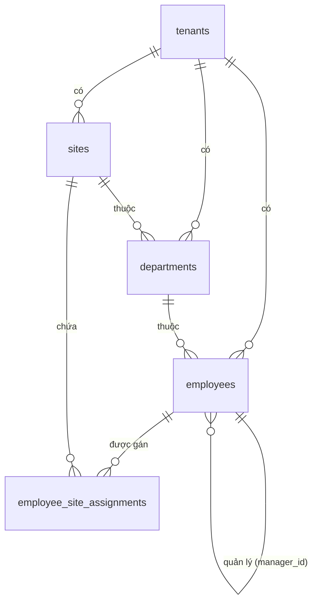

# Database Schema — M05: Quản lý Nhân sự

## Tables

### tenants
| Column | Type | Nullable | Default | Description |
|--------|------|----------|---------|-------------|
| id | UUID | No | gen_random_uuid() | PK |
| code | VARCHAR(50) | No | | Mã tenant (unique) |
| name | VARCHAR(255) | No | | Tên tổ chức |
| status | VARCHAR(20) | No | 'ACTIVE' | ACTIVE / INACTIVE |
| settings | JSONB | Yes | '{}' | Cấu hình tổ chức |
| created_at | TIMESTAMPTZ | No | now() | |
| updated_at | TIMESTAMPTZ | No | now() | |

### sites
| Column | Type | Nullable | Default | Description |
|--------|------|----------|---------|-------------|
| id | UUID | No | gen_random_uuid() | PK |
| tenant_id | UUID | No | | FK → tenants |
| code | VARCHAR(50) | No | | Mã chi nhánh |
| name | VARCHAR(255) | No | | Tên chi nhánh |
| timezone | VARCHAR(50) | No | 'Asia/Ho_Chi_Minh' | Múi giờ |
| address | TEXT | Yes | | Địa chỉ |
| closing_day | SMALLINT | No | 25 | Ngày chốt công (1–28) |
| status | VARCHAR(20) | No | 'ACTIVE' | ACTIVE / INACTIVE |
| created_at | TIMESTAMPTZ | No | now() | |

### departments
| Column | Type | Nullable | Default | Description |
|--------|------|----------|---------|-------------|
| id | UUID | No | gen_random_uuid() | PK |
| tenant_id | UUID | No | | FK → tenants |
| site_id | UUID | No | | FK → sites |
| code | VARCHAR(50) | No | | Mã phòng ban |
| name | VARCHAR(255) | No | | Tên phòng ban |
| parent_id | UUID | Yes | | FK → departments (tự tham chiếu) |
| head_employee_id | UUID | Yes | | Trưởng phòng |
| created_at | TIMESTAMPTZ | No | now() | |

### ranks
| Column | Type | Nullable | Default | Description |
|--------|------|----------|---------|-------------|
| id | UUID | No | gen_random_uuid() | PK |
| tenant_id | UUID | No | | FK → tenants |
| name | VARCHAR(100) | No | | Tên chức danh |
| level | SMALLINT | No | 1 | Cấp bậc (1 = thấp nhất) |

### employees
| Column | Type | Nullable | Default | Description |
|--------|------|----------|---------|-------------|
| id | UUID | No | gen_random_uuid() | PK |
| tenant_id | UUID | No | | FK → tenants |
| employee_code | VARCHAR(50) | No | | Mã nhân viên (unique/tenant) |
| full_name | VARCHAR(255) | No | | Họ và tên |
| email | VARCHAR(255) | No | | Email công ty |
| phone | VARCHAR(20) | Yes | | Số điện thoại |
| department_id | UUID | Yes | | FK → departments |
| rank_id | UUID | Yes | | FK → ranks |
| manager_id | UUID | Yes | | FK → employees (quản lý trực tiếp) |
| primary_site_id | UUID | No | | FK → sites (chi nhánh chính) |
| hire_date | DATE | No | | Ngày vào công ty |
| termination_date | DATE | Yes | | Ngày nghỉ việc |
| status | VARCHAR(20) | No | 'ACTIVE' | ACTIVE / INACTIVE / TERMINATED |
| role | VARCHAR(30) | No | 'EMPLOYEE' | EMPLOYEE / MANAGER / DEPT_HEAD / ... |
| created_at | TIMESTAMPTZ | No | now() | |

### employee_site_assignments
| Column | Type | Nullable | Default | Description |
|--------|------|----------|---------|-------------|
| id | UUID | No | gen_random_uuid() | PK |
| tenant_id | UUID | No | | FK → tenants |
| employee_id | UUID | No | | FK → employees |
| site_id | UUID | No | | FK → sites |
| role_at_site | VARCHAR(30) | No | 'EMPLOYEE' | Vai trò tại chi nhánh |
| status | VARCHAR(20) | No | 'ACTIVE' | ACTIVE / INACTIVE / TRANSFERRED |
| assigned_at | DATE | No | | Ngày bắt đầu |
| ended_at | DATE | Yes | | Ngày kết thúc |

### Indexes
| Name | Columns | Type |
|------|---------|------|
| idx_sites_tenant | tenant_id | BTREE |
| idx_departments_tenant_site | (tenant_id, site_id) | BTREE |
| idx_employees_tenant_code | (tenant_id, employee_code) | UNIQUE |
| idx_employees_manager | manager_id | BTREE |
| idx_esa_employee_site | (employee_id, site_id) | BTREE |

### Constraints
| Name | Type | Detail |
|------|------|--------|
| uq_tenant_code | UNIQUE | tenants(code) |
| uq_site_tenant_code | UNIQUE | sites(tenant_id, code) |
| uq_emp_site_active | UNIQUE | employee_site_assignments(employee_id, site_id) WHERE status='ACTIVE' |

## Relationships

