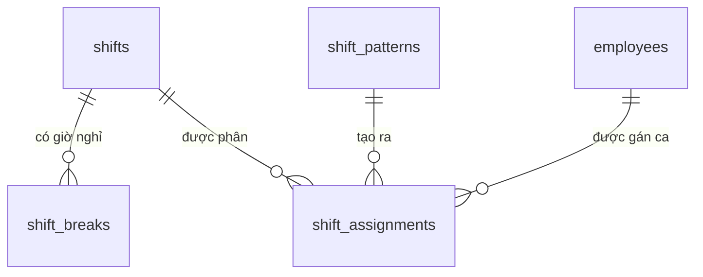

# Database Schema — M06: Ca Làm Việc

## Tables

### shifts
| Column | Type | Nullable | Default | Description |
|--------|------|----------|---------|-------------|
| id | UUID | No | gen_random_uuid() | PK |
| tenant_id | UUID | No | | FK → tenants |
| site_id | UUID | No | | FK → sites |
| code | VARCHAR(50) | No | | Mã ca (unique/tenant) |
| name | VARCHAR(255) | No | | Tên ca làm việc |
| type | VARCHAR(20) | No | | FIXED / FLEXIBLE / ROTATING / SPLIT / FREE |
| start_time | TIME | Yes | | Giờ bắt đầu ca |
| end_time | TIME | Yes | | Giờ kết thúc ca |
| working_hours | NUMERIC(4,2) | No | | Số giờ làm tiêu chuẩn |
| grace_period_minutes | SMALLINT | No | 15 | Phút ân hạn không tính trễ |
| early_checkin_minutes | SMALLINT | No | 30 | Phút cho phép check-in sớm |
| late_checkout_minutes | SMALLINT | No | 120 | Phút tối đa check-out muộn |
| is_night_shift | BOOLEAN | No | false | Ca đêm (22:00–06:00) |
| auto_detect_overtime | BOOLEAN | No | true | Tự động phát hiện OT |
| require_ot_approval | BOOLEAN | No | true | OT cần phê duyệt |
| is_active | BOOLEAN | No | true | |
| created_at | TIMESTAMPTZ | No | now() | |

### shift_breaks
| Column | Type | Nullable | Default | Description |
|--------|------|----------|---------|-------------|
| id | UUID | No | gen_random_uuid() | PK |
| tenant_id | UUID | No | | FK → tenants |
| shift_id | UUID | No | | FK → shifts |
| start_time | TIME | No | | Giờ bắt đầu nghỉ |
| end_time | TIME | No | | Giờ kết thúc nghỉ |
| is_paid | BOOLEAN | No | false | Có tính lương nghỉ không |
| label | VARCHAR(100) | Yes | | Nhãn (VD: Nghỉ trưa) |

### shift_assignments
| Column | Type | Nullable | Default | Description |
|--------|------|----------|---------|-------------|
| id | UUID | No | gen_random_uuid() | PK |
| tenant_id | UUID | No | | FK → tenants |
| employee_id | UUID | No | | FK → employees |
| shift_id | UUID | No | | FK → shifts |
| work_date | DATE | No | | Ngày áp dụng ca |
| source | VARCHAR(20) | No | 'MANUAL' | MANUAL / PATTERN |
| pattern_id | UUID | Yes | | FK → shift_patterns (nếu từ pattern) |
| version | INTEGER | No | 1 | Optimistic lock |
| created_by | UUID | No | | FK → employees |
| created_at | TIMESTAMPTZ | No | now() | |

### shift_patterns
| Column | Type | Nullable | Default | Description |
|--------|------|----------|---------|-------------|
| id | UUID | No | gen_random_uuid() | PK |
| tenant_id | UUID | No | | FK → tenants |
| site_id | UUID | No | | FK → sites |
| name | VARCHAR(255) | No | | Tên pattern |
| shift_sequence | UUID[] | No | | Mảng shift_id theo thứ tự xoay |
| start_date | DATE | No | | Ngày bắt đầu áp dụng |
| end_date | DATE | Yes | | Ngày kết thúc (null = vô hạn) |
| is_active | BOOLEAN | No | true | |

### Indexes
| Name | Columns | Type |
|------|---------|------|
| idx_shifts_tenant_site | (tenant_id, site_id) | BTREE |
| idx_shift_breaks_shift | shift_id | BTREE |
| idx_shift_assign_emp_date | (tenant_id, employee_id, work_date) | UNIQUE |
| idx_shift_assign_date | (tenant_id, work_date) | BTREE |

### Constraints
| Name | Type | Detail |
|------|------|--------|
| uq_shift_tenant_code | UNIQUE | shifts(tenant_id, code) |
| uq_shift_assign_emp_date | UNIQUE | shift_assignments(tenant_id, employee_id, work_date) |
| chk_shift_type | CHECK | type IN ('FIXED','FLEXIBLE','ROTATING','SPLIT','FREE') |

## Relationships

