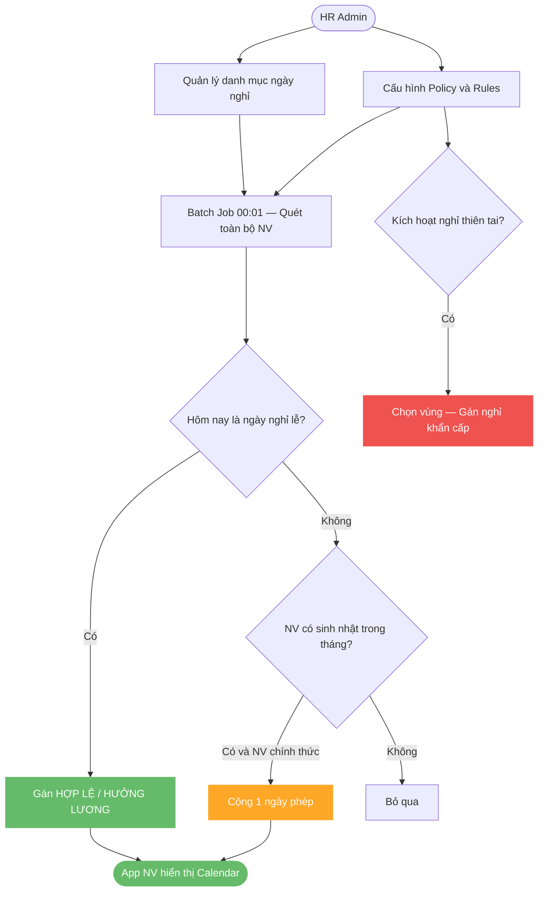
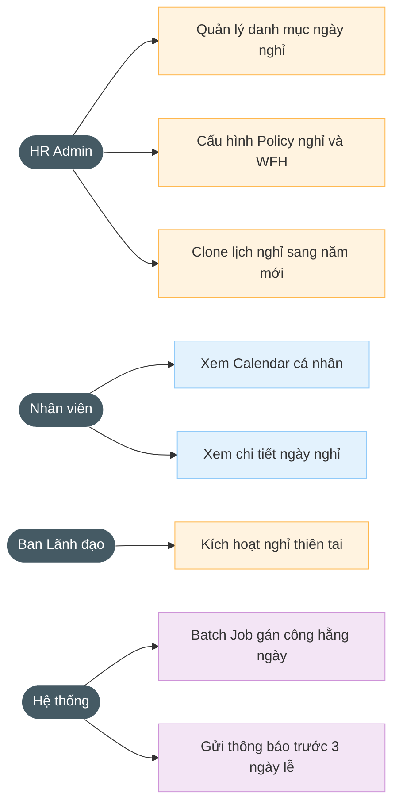

# 2.11.7. Cấu hình lịch nghỉ

---

| Thông tin | Nội dung |
| --- | --- |
| Target release | Version 1.0 (Sprint 8) |
| Epic | STRATOS-ADMIN: Hệ thống Quản trị & Cấu hình tập trung |
| Document owner | Business Analyst Team |
| Stakeholder | HR Admin, Toàn bộ Nhân viên |
| Status | Open |

---

### **1. MỤC TIÊU**

- **Lý do tồn tại:** Chuẩn hóa lịch trình nghỉ lễ của công ty và tự động hóa các chính sách đãi ngộ đặc thù (Sinh nhật, Bão lũ, WFH).
- **Bài toán:** Tránh việc nhân viên phải quẹt thẻ vào các ngày lễ quốc gia; Quản lý hạn mức làm việc từ xa (WFH) một cách công bằng.
- **Giá trị mang lại:** Giảm 90% khiếu nại về chấm công trong các ngày nghỉ lễ; Tự động hóa việc cộng ngày nghỉ sinh nhật cho nhân sự.

---

### **2. MÔ TẢ QUY TRÌNH NGHIỆP VỤ**

### **3. NHU CẦU NGƯỜI DÙNG**

| Persona | Nhu cầu cụ thể | Tài liệu / Căn cứ |
| --- | --- | --- |
| HR Admin | Muốn gán các ngày Lễ quốc gia (Tết, 30/4) để hệ thống tự động tính đủ công cho nhân viên mà họ không cần chấm công. | Holiday Catalog |
| Nhân viên | Muốn biết được trong năm có bao nhiêu ngày nghỉ Lễ chính thức và chính sách WFH của công ty như thế nào. | Personal Dashboard |
| Ban Lãnh đạo | Muốn kích hoạt nhanh chế độ "Nghỉ thiên tai" cho một khu vực/văn phòng cụ thể khi có sự cố khẩn cấp. | Disaster Recovery Policy |

---

### **4. USE CASE DIAGRAM**

### **5. PHẠM VI CHỨC NĂNG**

| Mã | Chức năng | Mô tả chi tiết | User Story |
| --- | --- | --- | --- |
| F07.1 | Quản trị Danh mục ngày nghỉ | Giao diện CRUD quản lý danh sách ngày nghỉ (Lễ quốc gia/Nội bộ). Hỗ trợ chọn ngày trên Calendar và gán loại hình nghỉ hưởng lương/không lương. | Là Admin, tôi muốn tự thiết lập danh mục ngày nghỉ để hệ thống có căn cứ tính công tự động cho toàn công ty. |
| F07.2 | Cấu hình Policy & Rules | Quản lý tham số: Bật/Tắt nghỉ sinh nhật; Hạn mức WFH tối đa/tuần; Kích hoạt Chế độ khẩn cấp (Thiên tai) cho từng khu vực/văn phòng. | Là Admin, tôi muốn cấu hình các tham số luật (Rules) để hệ thống tự động hóa các chế độ đãi ngộ mà không cần can thiệp thủ công. |
| F07.3 | Logic Sync & Batch Job | Tự động quét dữ liệu Ngày nghỉ/Sinh nhật để gán trạng thái "Hợp lệ" trên Nhật ký nhân viên. Đồng bộ Real-time mốc WFH/Công tác lên Dashboard. | Hệ thống tự động đồng bộ và tính công dựa trên lịch nghỉ/chính sách đã cấu hình để đảm bảo quyền lợi nhân viên chính xác 100%. |
| F07.4 | API & Mini App View | Xây dựng bộ API truy vấn lịch trình cá nhân. Hiển thị Calendar màu sắc (Đỏ/Xanh) và các thông báo nhắc nhở ngày nghỉ lễ trên App nhân viên. | Là Nhân viên, tôi muốn tra cứu lịch trình nghỉ lễ và hạn mức vắng mặt qua App để chủ động sắp xếp kế hoạch làm việc. |

### **6. YÊU CẦU PHI CHỨC NĂNG**

- **Tính kế thừa:** Lịch nghỉ lễ của năm nay có thể Clone sang năm sau để Admin chỉ cần chỉnh sửa ngày lẻ.
- **Thông báo:** Tự động gửi thông báo cho toàn thể nhân viên trước 03 ngày diễn ra nghỉ lễ chính thức.
- **Ràng buộc:** Không được gán 2 loại lễ trùng ngày nhau trên cùng một lịch làm việc.

---

### **EDGE CASES & ERROR HANDLING (toàn module)**

| # | US | Case | Severity | Expected Behavior |
|---|-----|------|----------|-------------------|
| H01-E1 | HOL-01 | **Tết Nguyên Đán — âm lịch** — Ngày Tết thay đổi mỗi năm | CRITICAL | Hệ thống seed danh sách ngày lễ VN theo năm dương lịch (đã convert). Admin **bắt buộc** xác nhận lại ngày Tết mỗi năm trước 01/12. Nếu chưa xác nhận → cảnh báo "Lịch Tết năm [X] chưa được xác nhận". Hỗ trợ tích hợp API âm-dương lịch. |
| H01-E2 | HOL-01 | **Lịch nghỉ khác nhau theo site** — Chi nhánh HCM và Hà Nội có ngày nghỉ nội bộ khác | HIGH | Hỗ trợ scope: COMPANY (toàn cty) và SITE (chi nhánh). Lịch COMPANY áp dụng tất cả. Lịch SITE chỉ áp dụng NV thuộc site đó. UI: dropdown chọn scope khi tạo ngày nghỉ. |
| H01-E3 | HOL-01 | **Ngày làm bù (Saturday substitution)** — Chính phủ quy định làm bù thứ 7 khi dịch nghỉ lễ | HIGH | Thêm loại "SUBSTITUTION_WORKDAY" trong holiday config. Ngày này: NV phải chấm công bình thường dù là T7/CN. Hệ thống KHÔNG tự gán "HỢP LỆ", đếm là ngày làm việc. |
| H02-E1 | HOL-02 | **Nghỉ thiên tai retroactively** — Admin kích hoạt nghỉ ngày 15/03 cho ngày 13-14/03 (2 ngày trước) | MEDIUM | Batch job re-process: cập nhật DailyAttendanceSummary ngày 13-14 → trạng thái "NGHỈ KHẨN CẤP". Xóa anomaly/vi phạm phát sinh trong 2 ngày đó. Ghi audit: "Retroactive emergency leave applied by [Admin]". |
| H03-E1 | HOL-03 | **Batch job fail giữa chừng** — Job 00:01 bị lỗi khi xử lý NV thứ 3000/5000 | HIGH | Transaction per-employee (không wrap toàn bộ 5000 NV). 3000 NV đã xử lý → giữ nguyên. 2000 NV chưa xử lý → ghi vào retry queue. Admin nhận alert + nút "Chạy lại batch job". Log chi tiết: NV nào thành công, NV nào lỗi. |

---

### **7. ĐIỀU KIỆN GIẢ ĐỊNH**

1. Hệ thống đã có danh sách nhân sự kèm Ngày sinh chính xác.
2. Quy hoạch location đã được gán để phục vụ việc bật "Nghỉ thiên tai" theo vùng.
