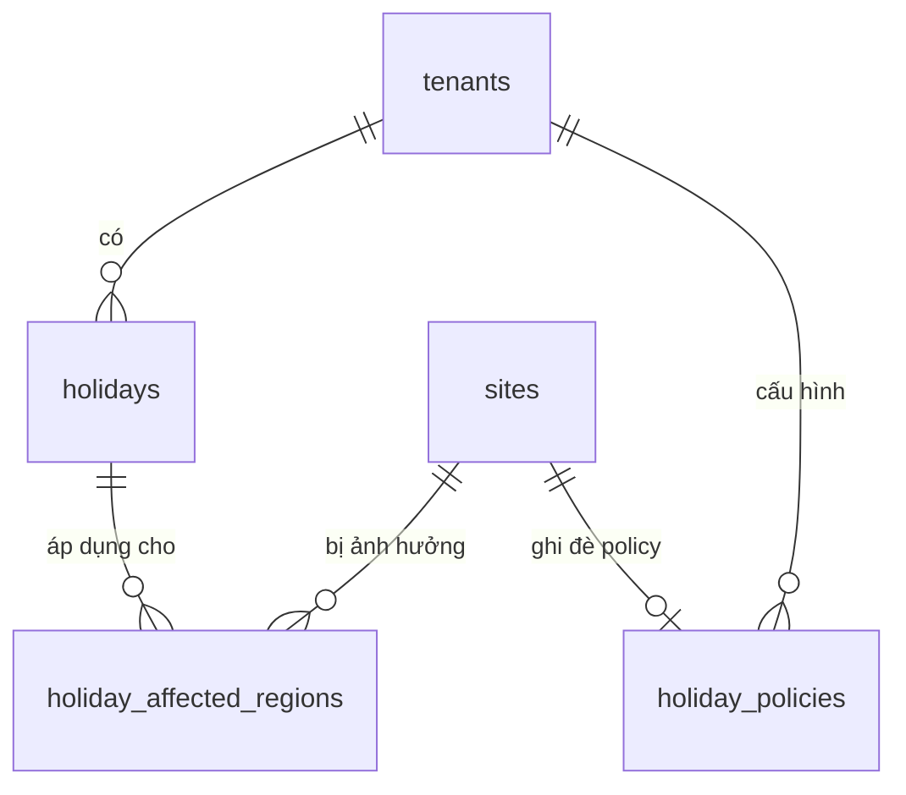

# Database Schema — M07: Lịch Nghỉ

## Tables

### holidays
| Column | Type | Nullable | Default | Description |
|--------|------|----------|---------|-------------|
| id | UUID | No | gen_random_uuid() | PK |
| tenant_id | UUID | No | | FK → tenants |
| name | VARCHAR(255) | No | | Tên ngày nghỉ |
| holiday_date | DATE | No | | Ngày nghỉ |
| type | VARCHAR(20) | No | | NATIONAL / INTERNAL |
| is_recurring | BOOLEAN | No | false | Lặp lại hàng năm (theo DD/MM) |
| ot_multiplier | NUMERIC(3,1) | No | 3.0 | Hệ số OT ngày lễ |
| description | TEXT | Yes | | Ghi chú |
| created_by | UUID | No | | FK → employees |
| created_at | TIMESTAMPTZ | No | now() | |

### holiday_affected_regions
| Column | Type | Nullable | Default | Description |
|--------|------|----------|---------|-------------|
| id | UUID | No | gen_random_uuid() | PK |
| tenant_id | UUID | No | | FK → tenants |
| holiday_id | UUID | No | | FK → holidays |
| site_id | UUID | Yes | | FK → sites (null = áp dụng tất cả) |
| applies_to_all | BOOLEAN | No | true | Áp dụng toàn tenant |

### holiday_policies
| Column | Type | Nullable | Default | Description |
|--------|------|----------|---------|-------------|
| id | UUID | No | gen_random_uuid() | PK |
| tenant_id | UUID | No | | FK → tenants |
| site_id | UUID | Yes | | FK → sites (null = mặc định toàn tenant) |
| birthday_leave_enabled | BOOLEAN | No | false | Bật phép sinh nhật |
| birthday_leave_days | SMALLINT | No | 1 | Số ngày phép sinh nhật |
| wfh_max_days_per_month | SMALLINT | No | 0 | Giới hạn WFH/tháng (0 = không áp dụng) |
| disaster_mode_enabled | BOOLEAN | No | false | Chế độ thiên tai (cho phép WFH hàng loạt) |
| updated_by | UUID | Yes | | FK → employees |
| updated_at | TIMESTAMPTZ | No | now() | |

### Indexes
| Name | Columns | Type |
|------|---------|------|
| idx_holidays_tenant_date | (tenant_id, holiday_date) | BTREE |
| idx_holidays_type | (tenant_id, type) | BTREE |
| idx_har_holiday | holiday_id | BTREE |
| idx_har_site | (tenant_id, site_id) | BTREE |
| idx_holiday_policy_tenant_site | (tenant_id, site_id) | UNIQUE |

### Constraints
| Name | Type | Detail |
|------|------|--------|
| chk_holiday_type | CHECK | type IN ('NATIONAL','INTERNAL') |
| uq_holiday_policy | UNIQUE | holiday_policies(tenant_id, site_id) |
| chk_ot_multiplier | CHECK | ot_multiplier > 0 |

## Relationships

