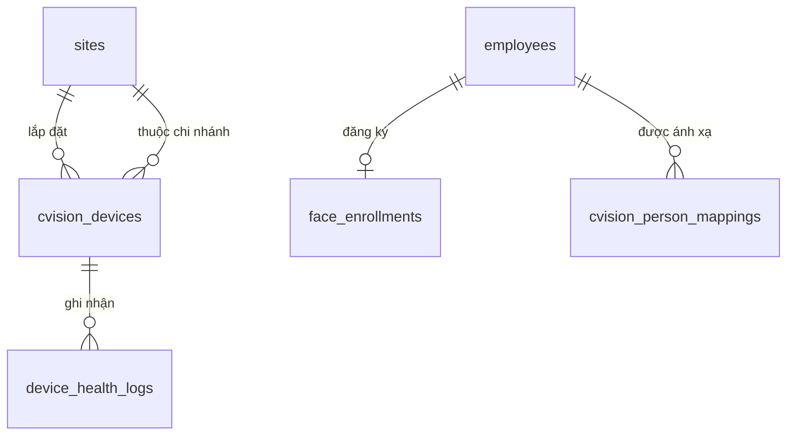

# Database Schema — M08: Camera AI (C-Vision)

## Tables

### cvision_devices
| Column | Type | Nullable | Default | Description |
|--------|------|----------|---------|-------------|
| id | UUID | No | gen_random_uuid() | PK |
| tenant_id | UUID | No | | FK → tenants |
| site_id | UUID | No | | FK → sites |
| device_id | VARCHAR(100) | No | | ID thiết bị trong hệ thống C-Vision |
| device_name | VARCHAR(255) | No | | Tên thiết bị |
| direction_type | VARCHAR(20) | No | 'BIDIRECTIONAL' | IN_ONLY / OUT_ONLY / BIDIRECTIONAL |
| confidence_threshold | NUMERIC(3,2) | No | 0.85 | Ngưỡng tin cậy nhận diện |
| status | VARCHAR(20) | No | 'ACTIVE' | ACTIVE / INACTIVE |
| location_note | TEXT | Yes | | Mô tả vị trí lắp đặt |
| last_event_at | TIMESTAMPTZ | Yes | | Thời điểm nhận webhook gần nhất |
| created_at | TIMESTAMPTZ | No | now() | |

### cvision_person_mappings
| Column | Type | Nullable | Default | Description |
|--------|------|----------|---------|-------------|
| id | UUID | No | gen_random_uuid() | PK |
| tenant_id | UUID | No | | FK → tenants |
| cvision_person_id | VARCHAR(100) | No | | personId từ C-Vision |
| employee_id | UUID | No | | FK → employees |
| employee_code | VARCHAR(50) | No | | Mã nhân viên (cache để tra cứu nhanh) |
| is_active | BOOLEAN | No | true | Deactivate khi NV nghỉ việc |
| created_at | TIMESTAMPTZ | No | now() | |
| deactivated_at | TIMESTAMPTZ | Yes | | Thời điểm deactivate |

### face_enrollments
| Column | Type | Nullable | Default | Description |
|--------|------|----------|---------|-------------|
| id | UUID | No | gen_random_uuid() | PK |
| tenant_id | UUID | No | | FK → tenants |
| employee_id | UUID | No | | FK → employees |
| status | VARCHAR(20) | No | 'NOT_ENROLLED' | NOT_ENROLLED / PENDING / ENROLLED / FAILED / RE_ENROLLMENT |
| enrolled_at | TIMESTAMPTZ | Yes | | Thời điểm đăng ký thành công |
| failed_reason | TEXT | Yes | | Lý do thất bại |
| retry_count | SMALLINT | No | 0 | Số lần thử lại trong phiên |
| initiated_by | UUID | Yes | | FK → employees (HR yêu cầu nếu RE_ENROLLMENT) |
| updated_at | TIMESTAMPTZ | No | now() | |

### device_health_logs
| Column | Type | Nullable | Default | Description |
|--------|------|----------|---------|-------------|
| id | UUID | No | gen_random_uuid() | PK |
| tenant_id | UUID | No | | FK → tenants |
| device_id | UUID | No | | FK → cvision_devices |
| event_type | VARCHAR(30) | No | | ONLINE / OFFLINE / LOW_CONFIDENCE / WEBHOOK_ERROR |
| detail | JSONB | Yes | '{}' | Chi tiết sự kiện |
| logged_at | TIMESTAMPTZ | No | now() | |

### Indexes
| Name | Columns | Type |
|------|---------|------|
| idx_cvision_devices_tenant_site | (tenant_id, site_id) | BTREE |
| idx_cvision_devices_device_id | (tenant_id, device_id) | UNIQUE |
| idx_person_mapping_person | (tenant_id, cvision_person_id) | UNIQUE WHERE is_active=true |
| idx_person_mapping_employee | (tenant_id, employee_id) | BTREE |
| idx_enrollment_employee | (tenant_id, employee_id) | UNIQUE |
| idx_health_logs_device_time | (device_id, logged_at DESC) | BTREE |

### Constraints
| Name | Type | Detail |
|------|------|--------|
| chk_direction_type | CHECK | direction_type IN ('IN_ONLY','OUT_ONLY','BIDIRECTIONAL') |
| chk_confidence_range | CHECK | confidence_threshold BETWEEN 0.5 AND 1.0 |
| chk_enrollment_status | CHECK | status IN ('NOT_ENROLLED','PENDING','ENROLLED','FAILED','RE_ENROLLMENT') |
| uq_device_per_tenant | UNIQUE | cvision_devices(tenant_id, device_id) |

## Relationships

