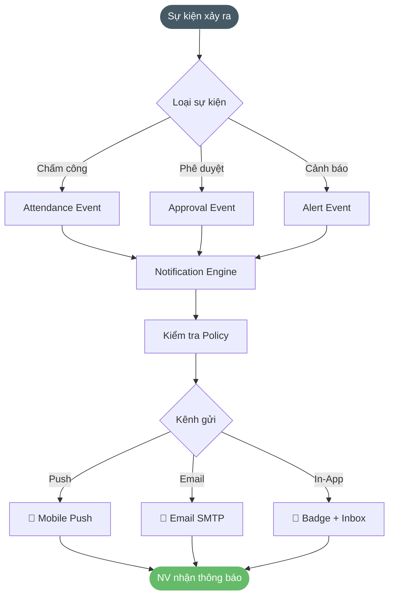

# 2.11.9. Cấu hình thông báo

---

| Thông tin | Nội dung |
| --- | --- |
| Target release | Version 1.0 (Sprint 8) |
| Epic | STRATOS-ADMIN: Hệ thống Quản trị & Cấu hình tập trung |
| Document owner | BA Team |
| Stakeholder | HR Admin, IT Admin, Nhân viên |
| Status | Draft |
| Tham chiếu | EAMS v2.0 — Module 09 (Overview) |

---

### **1. MỤC TIÊU**

- **Lý do tồn tại:** Hệ thống chấm công phát sinh nhiều sự kiện cần thông báo kịp thời (chấm công thành công, đơn từ thay đổi trạng thái, cảnh báo vi phạm, nhắc nhở).
- **Bài toán:** Cung cấp công cụ cho Admin cấu hình kênh, điều kiện kích hoạt và policy gửi thông báo cho từng loại sự kiện.
- **Giá trị mang lại:** Giảm 70% các trường hợp NV không biết trạng thái đơn; phát hiện vi phạm kịp thời.

---

### **2. MÔ TẢ QUY TRÌNH NGHIỆP VỤ**




```
Admin truy cập "Cấu hình thông báo"
        ↓
  ├─ Cấu hình kênh (Channels):
  │   ├─ App Push Notification (ưu tiên)
  │   ├─ Email (cho đơn từ cần lưu trữ)
  │   └─ Popup Dashboard
  │
  ├─ Cấu hình sự kiện kích hoạt (Triggers):
  │   ├─ Sự kiện chấm công: thông báo < 60s
  │   ├─ Sự kiện đơn từ: trạng thái thay đổi
  │   └─ Sự kiện định kỳ: nhắc nhở đầu/cuối ca
  │
  └─ Cấu hình policy gửi:
      ├─ Gom tin (Batching): gom nhiều event gửi 1 lần
      ├─ Chống nhiễu (Throttle): tối đa N thông báo/giờ
      └─ Lập lịch (Schedule): chỉ gửi trong khung giờ
```

---

### **3. NHU CẦU NGƯỜI DÙNG**

| Persona | Nhu cầu cụ thể | Tài liệu / Căn cứ |
| --- | --- | --- |
| HR Admin | Muốn cấu hình thông báo chấm công thành công gửi ngay cho NV qua Push. | Channel & Trigger config |
| IT Admin | Muốn nhận cảnh báo tức thời khi camera offline hoặc có security event. | Priority notification |
| Nhân viên | Muốn tắt thông báo nhắc nhở nhưng vẫn nhận kết quả phê duyệt đơn. | Personal preference |

---

### **4. PHẠM VI CHỨC NĂNG**

| Mã | Chức năng | Mô tả chi tiết | User Story |
| --- | --- | --- | --- |
| F09.1 | Cấu hình kênh thông báo | Quản lý kênh: Push/Email/Popup. Bật/tắt từng kênh theo loại sự kiện. Thiết lập kênh ưu tiên (fallback). | [US-NOTIF-01](./us-notif-01-cau-hinh-kenh-thong-bao.md) |
| F09.2 | Cấu hình sự kiện kích hoạt | Danh sách 36 loại sự kiện. Bật/tắt trigger cho từng event. Thiết lập template nội dung thông báo. | [US-NOTIF-02](./us-notif-02-cau-hinh-su-kien-kich-hoat.md) |
| F09.3 | Quản lý policy gửi thông báo | Cấu hình Batching, Throttle, Schedule. Cho phép NV tắt/mở thông báo cá nhân (trừ thông báo bắt buộc). | [US-NOTIF-03](./us-notif-03-quan-ly-policy-thong-bao.md) |

---

### **5. PHÂN LOẠI SỰ KIỆN**

| Nhóm | Ví dụ sự kiện | Kênh mặc định | Bắt buộc |
| --- | --- | --- | --- |
| Chấm công | Check-in/out thành công, nhận diện thất bại | Push | Không |
| Đơn từ | Đơn được duyệt/từ chối, đơn mới cần duyệt | Push + Email | Có |
| Cảnh báo | Vi phạm quy chế, gần hạn chốt công, vượt OT | Push | Có |
| Nhắc nhở | Nhắc chấm công đầu/cuối ca, lịch nghỉ lễ | Push | Không |
| Hệ thống | Camera offline, batch job lỗi, security event | Email | Có (Admin) |

---

### **6. YÊU CẦU PHI CHỨC NĂNG**

- **Độ trễ:** Thông báo chấm công gửi trong < 60 giây; thông báo đơn từ < 30 giây.
- **Ràng buộc:** NV không được tắt thông báo bắt buộc (kết quả phê duyệt, kỷ luật lao động).
- **Scale:** Hỗ trợ gửi thông báo cho 5,000+ NV đồng thời.
- **Audit:** Ghi log lịch sử gửi thông báo để truy vết.

---

### **EDGE CASES & ERROR HANDLING (toàn module)**

| # | US | Case | Severity | Expected Behavior |
|---|-----|------|----------|-------------------|
| N01-E1 | NOTIF-01 | **Push service down** — Firebase/APNs down | HIGH | Queue thông báo với exponential backoff retry (1s, 2s, 4s, 8s... max 5 phút). Sau 3 lần fail → fallback sang Email. Sau 5 lần fail tất cả kênh → ghi dead letter queue + alert Admin "Notification service degraded". |
| N01-E2 | NOTIF-01 | **NV gỡ app** — Push token bị vô hiệu | MEDIUM | Detect invalid token từ Firebase response (410 Gone). Auto-fallback sang Email cho NV đó. Thông báo bắt buộc (phê duyệt, kỷ luật) → gửi Email bất kể. Dashboard Admin hiển thị "X NV không có Push token — chỉ nhận Email". |
| N02-E1 | NOTIF-02 | **Notification storm** — 500 NV chấm công cùng lúc 8:00 sáng | HIGH | Batching window 10 giây cho sự kiện check-in đồng loạt. Rate limit: tối đa 500 push/giây (Firebase limit). Queue overflow → delay gửi trong 1-2 phút, không drop. |
| N03-E1 | NOTIF-03 | **Schedule vs Ca đêm** — Khung gửi 07:00-22:00 nhưng NV làm ca đêm | MEDIUM | NV ca đêm (isNightShift=true): exempt khỏi schedule restriction. Thông báo nhắc chấm công ca đêm gửi ngay bất kể giờ. Cấu hình: checkbox "Áp dụng schedule cho NV ca đêm" (default: OFF). |

---

### **7. ĐIỀU KIỆN GIẢ ĐỊNH**

1. Hệ thống Push Notification đã được tích hợp (Firebase/APNs).
2. Email server đã được cấu hình (SMTP).
3. Nhân viên đã cài đặt Mini App và cho phép nhận thông báo.
