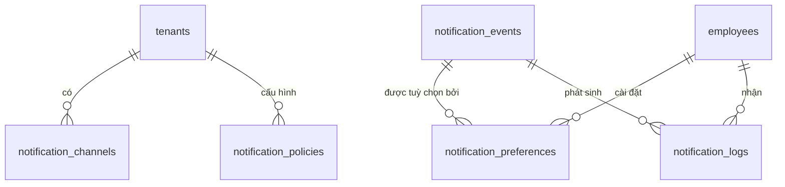

# Database Schema — M09: Thông Báo

## Tables

### notification_channels
| Column | Type | Nullable | Default | Description |
|--------|------|----------|---------|-------------|
| id | UUID | No | gen_random_uuid() | PK |
| tenant_id | UUID | No | | FK → tenants |
| type | VARCHAR(20) | No | | PUSH / EMAIL / POPUP |
| provider | VARCHAR(50) | Yes | | Firebase, SMTP, v.v. |
| config | JSONB | No | '{}' | Cấu hình kết nối (mã hóa) |
| is_active | BOOLEAN | No | true | |
| priority | SMALLINT | No | 1 | Thứ tự fallback (1=cao nhất) |

### notification_events
| Column | Type | Nullable | Default | Description |
|--------|------|----------|---------|-------------|
| id | UUID | No | gen_random_uuid() | PK |
| event_key | VARCHAR(100) | No | | Mã sự kiện (VD: LEAVE_APPROVED) |
| group | VARCHAR(50) | No | | attendance / request / alert / reminder / system |
| label | VARCHAR(255) | No | | Tên hiển thị tiếng Việt |
| is_mandatory | BOOLEAN | No | false | Nhân viên không thể tắt |
| default_channels | VARCHAR(20)[] | No | '{}' | Kênh mặc định [PUSH, EMAIL, POPUP] |

### notification_policies
| Column | Type | Nullable | Default | Description |
|--------|------|----------|---------|-------------|
| id | UUID | No | gen_random_uuid() | PK |
| tenant_id | UUID | No | | FK → tenants |
| site_id | UUID | Yes | | FK → sites (null = toàn tenant) |
| batch_window_minutes | SMALLINT | No | 15 | Gom sự kiện trong N phút |
| throttle_per_hour | SMALLINT | No | 20 | Tối đa N thông báo/giờ/NV |
| schedule_start | TIME | No | '07:00' | Giờ bắt đầu gửi |
| schedule_end | TIME | No | '22:00' | Giờ kết thúc gửi |
| night_shift_exempt | BOOLEAN | No | true | Ca đêm được exempt khỏi schedule |
| updated_at | TIMESTAMPTZ | No | now() | |

### notification_preferences
| Column | Type | Nullable | Default | Description |
|--------|------|----------|---------|-------------|
| id | UUID | No | gen_random_uuid() | PK |
| tenant_id | UUID | No | | FK → tenants |
| employee_id | UUID | No | | FK → employees |
| event_key | VARCHAR(100) | No | | FK → notification_events(event_key) |
| enabled | BOOLEAN | No | true | Bật/tắt sự kiện này |
| channels | VARCHAR(20)[] | No | '{}' | Kênh NV chọn |

### notification_logs
| Column | Type | Nullable | Default | Description |
|--------|------|----------|---------|-------------|
| id | UUID | No | gen_random_uuid() | PK |
| tenant_id | UUID | No | | FK → tenants |
| employee_id | UUID | No | | FK → employees (người nhận) |
| event_key | VARCHAR(100) | No | | Loại sự kiện |
| channel | VARCHAR(20) | No | | Kênh gửi |
| status | VARCHAR(20) | No | | SENT / FAILED / DEAD_LETTER |
| payload | JSONB | No | '{}' | Nội dung thông báo |
| error_message | TEXT | Yes | | Lỗi nếu thất bại |
| sent_at | TIMESTAMPTZ | No | now() | |

### Indexes
| Name | Columns | Type |
|------|---------|------|
| idx_notif_events_key | event_key | UNIQUE |
| idx_notif_pref_emp | (tenant_id, employee_id, event_key) | UNIQUE |
| idx_notif_logs_emp_sent | (tenant_id, employee_id, sent_at DESC) | BTREE |
| idx_notif_logs_status | (tenant_id, status) WHERE status='FAILED' | PARTIAL |
| idx_notif_policy_tenant_site | (tenant_id, site_id) | UNIQUE |

### Constraints
| Name | Type | Detail |
|------|------|--------|
| chk_channel_type | CHECK | type IN ('PUSH','EMAIL','POPUP') |
| uq_notif_pref | UNIQUE | notification_preferences(tenant_id, employee_id, event_key) |

## Relationships

