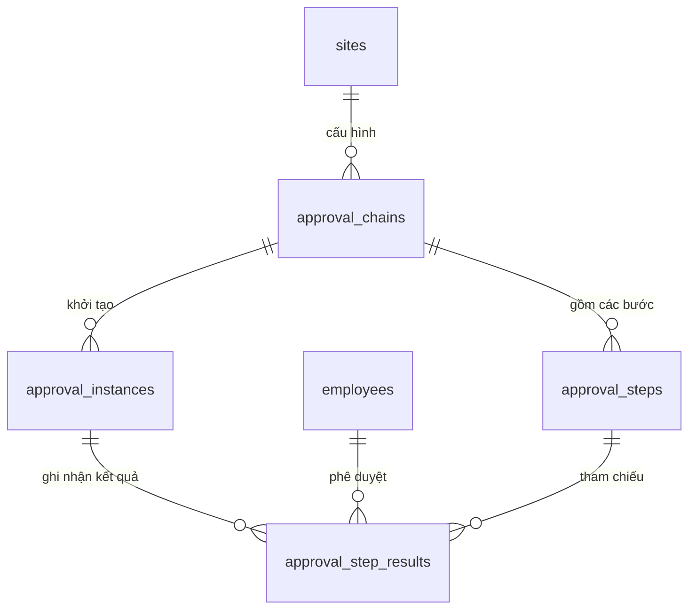

# Database Schema — M10: Phê Duyệt

## Tables

### approval_chains
| Column | Type | Nullable | Default | Description |
|--------|------|----------|---------|-------------|
| id | UUID | No | gen_random_uuid() | PK |
| tenant_id | UUID | No | | FK → tenants |
| site_id | UUID | No | | FK → sites |
| request_type | VARCHAR(30) | No | | LEAVE / OT_REQUEST / CORRECTION / MANUAL_ATTENDANCE |
| name | VARCHAR(255) | No | | Tên chuỗi phê duyệt |
| is_active | BOOLEAN | No | true | |
| created_at | TIMESTAMPTZ | No | now() | |

### approval_steps
| Column | Type | Nullable | Default | Description |
|--------|------|----------|---------|-------------|
| id | UUID | No | gen_random_uuid() | PK |
| tenant_id | UUID | No | | FK → tenants |
| chain_id | UUID | No | | FK → approval_chains |
| level | SMALLINT | No | | Cấp độ phê duyệt (1 = đầu tiên) |
| approver_type | VARCHAR(30) | No | | DIRECT_MANAGER / DEPT_HEAD / SITE_MANAGER / SITE_HR / GLOBAL_HR |
| condition_field | VARCHAR(50) | Yes | | Trường điều kiện (VD: working_days) |
| condition_operator | VARCHAR(5) | Yes | | GT / GTE / LT / LTE / EQ |
| condition_value | NUMERIC(8,2) | Yes | | Giá trị ngưỡng điều kiện |
| timeout_hours | SMALLINT | Yes | | Tự động escalate sau N giờ |

### approval_instances
| Column | Type | Nullable | Default | Description |
|--------|------|----------|---------|-------------|
| id | UUID | No | gen_random_uuid() | PK |
| tenant_id | UUID | No | | FK → tenants |
| request_type | VARCHAR(30) | No | | Loại yêu cầu |
| request_id | UUID | No | | ID của yêu cầu (polymorphic) |
| chain_id | UUID | No | | FK → approval_chains |
| current_level | SMALLINT | No | 1 | Cấp đang chờ duyệt |
| status | VARCHAR(20) | No | 'PENDING' | PENDING / APPROVED / REJECTED / CANCELLED |
| created_at | TIMESTAMPTZ | No | now() | |
| completed_at | TIMESTAMPTZ | Yes | | Thời điểm hoàn thành |

### approval_step_results
| Column | Type | Nullable | Default | Description |
|--------|------|----------|---------|-------------|
| id | UUID | No | gen_random_uuid() | PK |
| tenant_id | UUID | No | | FK → tenants |
| instance_id | UUID | No | | FK → approval_instances |
| step_id | UUID | No | | FK → approval_steps |
| level | SMALLINT | No | | Cấp phê duyệt |
| approver_id | UUID | No | | FK → employees (người phê duyệt thực tế) |
| action | VARCHAR(20) | No | | APPROVED / REJECTED / ESCALATED |
| comment | TEXT | Yes | | Ghi chú phê duyệt |
| acted_at | TIMESTAMPTZ | No | now() | |

### Indexes
| Name | Columns | Type |
|------|---------|------|
| idx_approval_chains_site_type | (tenant_id, site_id, request_type) | BTREE |
| idx_approval_steps_chain | (chain_id, level) | BTREE |
| idx_approval_inst_request | (tenant_id, request_type, request_id) | BTREE |
| idx_approval_inst_status | (tenant_id, status) WHERE status='PENDING' | PARTIAL |
| idx_approval_results_instance | (instance_id, level) | BTREE |
| idx_approval_results_approver | (tenant_id, approver_id) | BTREE |

### Constraints
| Name | Type | Detail |
|------|------|--------|
| chk_request_type | CHECK | request_type IN ('LEAVE','OT_REQUEST','CORRECTION','MANUAL_ATTENDANCE') |
| chk_approver_type | CHECK | approver_type IN ('DIRECT_MANAGER','DEPT_HEAD','SITE_MANAGER','SITE_HR','GLOBAL_HR') |
| chk_inst_status | CHECK | status IN ('PENDING','APPROVED','REJECTED','CANCELLED') |
| chk_step_action | CHECK | action IN ('APPROVED','REJECTED','ESCALATED') |
| chk_condition_op | CHECK | condition_operator IN ('GT','GTE','LT','LTE','EQ') |

## Relationships

