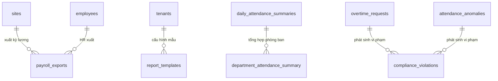

# Database Schema — M11: Báo Cáo Tổng Hợp

## Tables

### payroll_exports
| Column | Type | Nullable | Default | Description |
|--------|------|----------|---------|-------------|
| id | UUID | No | gen_random_uuid() | PK |
| tenant_id | UUID | No | | FK → tenants |
| site_id | UUID | No | | FK → sites |
| period_year | SMALLINT | No | | Năm kỳ lương |
| period_month | SMALLINT | No | | Tháng kỳ lương (1–12) |
| version | SMALLINT | No | 1 | Phiên bản xuất (re-export tăng version) |
| status | VARCHAR(20) | No | 'DRAFT' | DRAFT / LOCKED / SUPPLEMENTARY |
| file_url | TEXT | Yes | | URL file Excel/CSV xuất |
| row_count | INTEGER | Yes | | Số dòng nhân viên trong file |
| exported_by | UUID | No | | FK → employees (HR xuất) |
| locked_at | TIMESTAMPTZ | Yes | | Thời điểm khóa kỳ lương |
| created_at | TIMESTAMPTZ | No | now() | |

### report_templates
| Column | Type | Nullable | Default | Description |
|--------|------|----------|---------|-------------|
| id | UUID | No | gen_random_uuid() | PK |
| tenant_id | UUID | No | | FK → tenants |
| name | VARCHAR(255) | No | | Tên mẫu báo cáo |
| report_type | VARCHAR(30) | No | | DAILY / MONTHLY / OT / LEAVE / PAYROLL |
| columns_config | JSONB | No | '[]' | Cấu hình cột hiển thị và thứ tự |
| filter_defaults | JSONB | No | '{}' | Bộ lọc mặc định |
| is_system | BOOLEAN | No | false | Mẫu hệ thống (không xoá được) |
| created_by | UUID | Yes | | FK → employees |
| created_at | TIMESTAMPTZ | No | now() | |

---

## Views

### department_attendance_summary
```sql
CREATE VIEW department_attendance_summary AS
SELECT
    das.tenant_id,
    das.site_id,
    e.department_id,
    das.work_date,
    COUNT(*)                                             AS total_employees,
    COUNT(*) FILTER (WHERE das.status = 'PRESENT')      AS present_count,
    COUNT(*) FILTER (WHERE das.status IN ('LATE','LATE_AND_EARLY'))
                                                         AS late_count,
    COUNT(*) FILTER (WHERE das.status = 'ABSENT')        AS absent_count,
    COUNT(*) FILTER (WHERE das.status = 'ON_LEAVE')      AS on_leave_count,
    ROUND(AVG(das.net_hours), 2)                         AS avg_net_hours,
    SUM(das.overtime_hours)                              AS total_ot_hours
FROM daily_attendance_summaries das
JOIN employees e ON e.id = das.employee_id
GROUP BY das.tenant_id, das.site_id, e.department_id, das.work_date;
```

### compliance_violations
```sql
CREATE VIEW compliance_violations AS
SELECT
    ot.tenant_id,
    ot.employee_id,
    ot.site_id,
    ot.ot_date,
    'OT_DAILY_LIMIT'                                     AS violation_type,
    ot.ot_hours                                          AS value,
    4.0                                                  AS limit_value,
    'Tăng ca vượt 4h/ngày (Luật LĐ §106)'               AS description
FROM overtime_requests ot
WHERE ot.status = 'APPROVED'
  AND ot.ot_hours > 4

UNION ALL

SELECT
    aa.tenant_id,
    aa.employee_id,
    das.site_id,
    aa.work_date,
    'UNRESOLVED_ANOMALY'                                 AS violation_type,
    1                                                    AS value,
    0                                                    AS limit_value,
    'Vi phạm chưa giải trình sau ngày chốt'              AS description
FROM attendance_anomalies aa
JOIN daily_attendance_summaries das
    ON das.employee_id = aa.employee_id AND das.work_date = aa.work_date
WHERE aa.is_resolved = false;
```

---

### Indexes
| Name | Columns | Type |
|------|---------|------|
| idx_payroll_exports_period | (tenant_id, site_id, period_year, period_month, version) | UNIQUE |
| idx_payroll_exports_status | (tenant_id, status) WHERE status = 'LOCKED' | PARTIAL |
| idx_report_templates_tenant | (tenant_id, report_type) | BTREE |

### Constraints
| Name | Type | Detail |
|------|------|--------|
| chk_payroll_status | CHECK | status IN ('DRAFT','LOCKED','SUPPLEMENTARY') |
| chk_report_type | CHECK | report_type IN ('DAILY','MONTHLY','OT','LEAVE','PAYROLL') |
| chk_period_month | CHECK | period_month BETWEEN 1 AND 12 |
| uq_payroll_version | UNIQUE | payroll_exports(tenant_id, site_id, period_year, period_month, version) |

## Relationships


