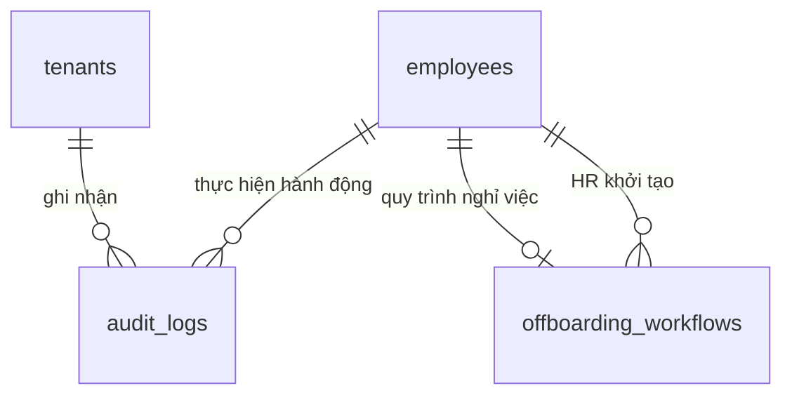

# Database Schema — M12: Quản Trị Hệ Thống

## Tables

### audit_logs
| Column | Type | Nullable | Default | Description |
|--------|------|----------|---------|-------------|
| id | UUID | No | gen_random_uuid() | PK |
| tenant_id | UUID | No | | FK → tenants |
| user_id | UUID | No | | FK → employees (người thực hiện) |
| module | VARCHAR(50) | No | | Tên module (VD: ATTENDANCE, LEAVE, SHIFT) |
| action | VARCHAR(20) | No | | CREATE / UPDATE / DELETE / UNLOCK / EXPORT |
| entity_type | VARCHAR(50) | No | | Loại đối tượng (VD: attendance_record) |
| entity_id | UUID | Yes | | ID đối tượng bị tác động |
| old_value | JSONB | Yes | | Giá trị trước thay đổi |
| new_value | JSONB | Yes | | Giá trị sau thay đổi |
| ip_address | INET | Yes | | Địa chỉ IP người dùng |
| user_agent | TEXT | Yes | | Trình duyệt / thiết bị |
| timestamp | TIMESTAMPTZ | No | now() | Thời điểm thực hiện (immutable) |

### offboarding_workflows
| Column | Type | Nullable | Default | Description |
|--------|------|----------|---------|-------------|
| id | UUID | No | gen_random_uuid() | PK |
| tenant_id | UUID | No | | FK → tenants |
| employee_id | UUID | No | | FK → employees (NV nghỉ việc) |
| termination_date | DATE | No | | Ngày nghỉ việc hiệu lực |
| steps | JSONB | No | '[]' | Danh sách bước xử lý và trạng thái từng bước |
| status | VARCHAR(20) | No | 'PENDING' | PENDING / IN_PROGRESS / COMPLETED / FAILED |
| initiated_by | UUID | No | | FK → employees (HR khởi tạo) |
| completed_at | TIMESTAMPTZ | Yes | | Thời điểm hoàn thành toàn bộ |
| created_at | TIMESTAMPTZ | No | now() | |
| updated_at | TIMESTAMPTZ | No | now() | |

> **Cấu trúc `steps` JSONB:**
> ```json
> [
>   { "step": "cancel_pending_requests", "status": "COMPLETED", "done_at": "..." },
>   { "step": "freeze_leave_balance",    "status": "COMPLETED", "done_at": "..." },
>   { "step": "remove_shift_assignments","status": "PENDING" },
>   { "step": "deactivate_cvision_mapping","status": "PENDING" },
>   { "step": "remove_from_approval_chain","status": "PENDING" },
>   { "step": "deactivate_push_token",   "status": "PENDING" }
> ]
> ```

### Indexes
| Name | Columns | Type |
|------|---------|------|
| idx_audit_logs_tenant_time | (tenant_id, timestamp DESC) | BTREE |
| idx_audit_logs_user | (tenant_id, user_id, timestamp DESC) | BTREE |
| idx_audit_logs_module_action | (tenant_id, module, action) | BTREE |
| idx_audit_logs_entity | (tenant_id, entity_type, entity_id) | BTREE |
| idx_offboarding_employee | (tenant_id, employee_id) | UNIQUE |
| idx_offboarding_status | (tenant_id, status) WHERE status IN ('PENDING','IN_PROGRESS') | PARTIAL |

### Constraints
| Name | Type | Detail |
|------|------|--------|
| chk_audit_action | CHECK | action IN ('CREATE','UPDATE','DELETE','UNLOCK','EXPORT','LOGIN','LOGOUT') |
| chk_offboarding_status | CHECK | status IN ('PENDING','IN_PROGRESS','COMPLETED','FAILED') |
| uq_offboarding_employee | UNIQUE | offboarding_workflows(tenant_id, employee_id) WHERE status NOT IN ('COMPLETED','FAILED') |

> **Bảo toàn dữ liệu:** `audit_logs` là immutable — không có UPDATE/DELETE trên bảng này.
> Retention: 3 năm theo quy định nội bộ. Batch job dọn dẹp chạy 00:00 ngày 01/01 hàng năm.

## Relationships


