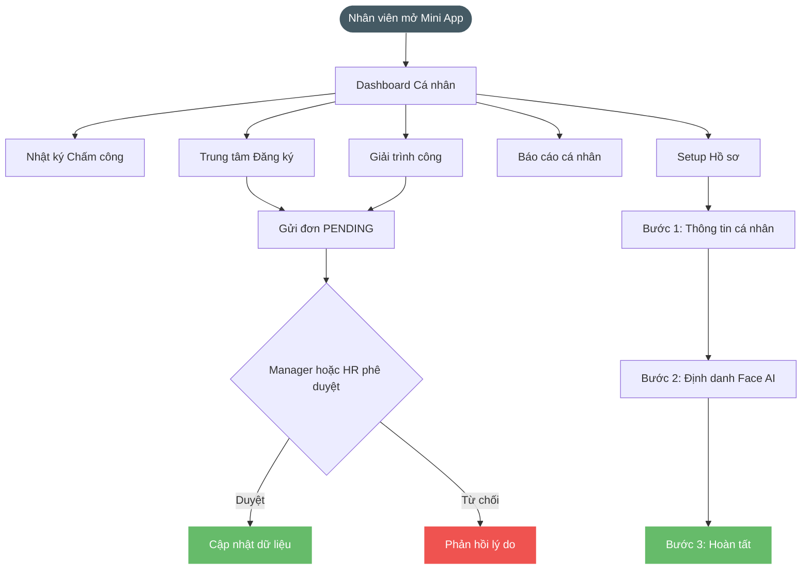
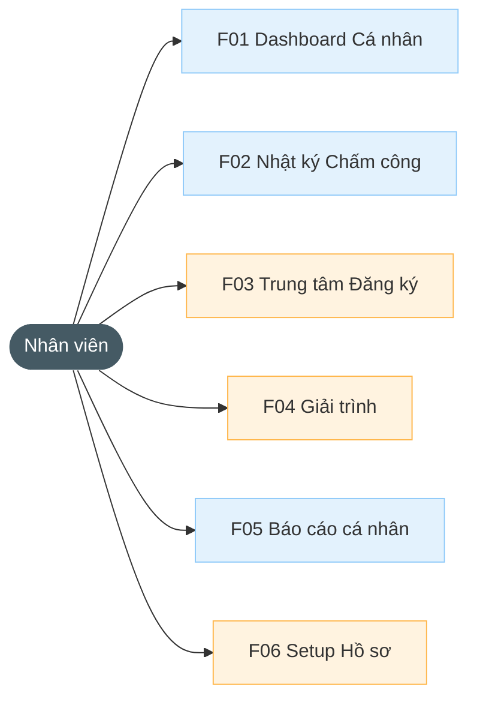

# BRD Nhân viên

---

| Thông tin | Nội dung |
| --- | --- |
| Target release | Version 1.0 |
| Epic | STRATOS-ESS: Trải nghiệm dành cho Nhân viên |
| Document owner | ndthuy1 |
| Stakeholder | Toàn bộ Nhân viên |
| Status | Open |

### **1. MỤC TIÊU**

- **Lý do tồn tại:** Nhân viên cần quyền truy cập thông tin công việc, chấm công và hiệu suất cá nhân chủ động.
- **Bài toán:** Loại bỏ việc hỏi đáp thủ công về giờ công, gửi đơn giấy và giúp nhân viên tự định danh khuôn mặt chấm công.
- **Giá trị mang lại:** Nâng cao sự hài lòng của nhân viên thông qua sự minh bạch về dữ liệu giờ công và KPIs.

### **2. MÔ TẢ QUY TRÌNH NGHIỆP VỤ**

### **3. NHU CẦU NGƯỜI DÙNG**

| Persona | Nhu cầu cụ thể | Tài liệu |
| --- | --- | --- |
| Nhân viên | Muốn biết hôm nay mình đã làm được bao nhiêu tiếng (Progress) và bao giờ thì đủ 8 tiếng. | Dashboard Cá nhân |
| Nhân viên | Cần tự cập nhật ảnh quét khuôn mặt Face ID để không phải nhờ IT hỗ trợ. | Setup cá nhân |
| Nhân viên | Muốn xem báo cáo hiệu suất cá nhân (KPI) để biết mình có được thưởng năng suất. | Báo cáo hiệu suất cá nhân |

### **4. USE CASE**

### **5. PHẠM VI CHỨC NĂNG**

| Mã | Chức năng | Mô tả | User Story |
| --- | --- | --- | --- |
| F01 | Dashboard Cá nhân | Xem giờ vào, Thanh tiến độ 8h (Progress bar) nhảy real-time. % Đúng giờ. | Là NV, tôi muốn xem mình đã làm đủ ca hôm nay chưa. |
| F02 | Nhật ký Chấm công | Danh sách ngày vào/ra kèm tag trạng thái (Đúng giờ/Vào trễ). | Là NV, tôi muốn đối soát lại giờ quẹt mặt tuần qua. |
| F03 | Trung tâm đăng ký | Form: Nghỉ phép, Đổi ca, OT, Nghỉ ko lương. Theo dõi hạn mức phép năm. | Là NV, tôi muốn gửi đơn xin nghỉ ngay trên điện thoại. |
| F04 | Giải trình cá nhân | Case: Giải trình muộn/sớm kèm ảnh. Case: Tự động khóa nút giải trình sau ngày chốt công. | Là NV, tôi muốn giải trình lỗi công để giữ chuyên cần. |
| F05 | Báo cáo cá nhân | Score chuyên cần, Tổng giờ làm tháng, Bảng KPI Highlights. | Là NV, tôi muốn theo dõi KPI năng lực quý của mình. |
| F06 | Setup Hồ sơ & Face ID | Quy trình 3 bước: Xác nhận thông tin → Chụp ảnh khuôn mặt (kiểm tra chất lượng) → Đồng bộ C-Vision. Chi tiết: [US-CAM-04](../2.11.8.-Cấu-hình-Camera-AI/us-cam-04-dang-ky-khuon-mat-nhan-vien.md). | Là NV mới, tôi muốn tự đăng ký khuôn mặt để điểm danh. |

### **6. YÊU CẦU PHI CHỨC NĂNG**

- Giao diện  Web/Mobile Mini App, hỗ trợ đa nền tảng (iOS/Android).
- Đồng bộ dữ liệu khuôn mặt sang Camera AI thành công trong vòng < 60 giây.
- Thông báo Push Notification ngay khi trạng thái đơn phê duyệt thay đổi.
- Bảo mật thông tin khuôn mặt chỉ dùng cho định danh chấm công.

### **7. ĐIỀU KIỆN GIẢ ĐỊNH**

- Nhân viên đã được cấp tài khoản định danh trên hệ thống Stratos.
- Smartphone của nhân viên có camera hoạt động để thực hiện định danh (Enrollment).
