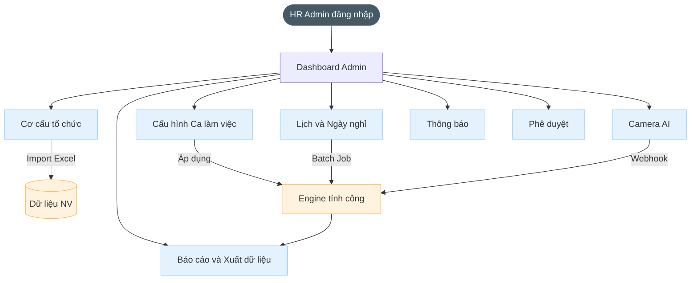
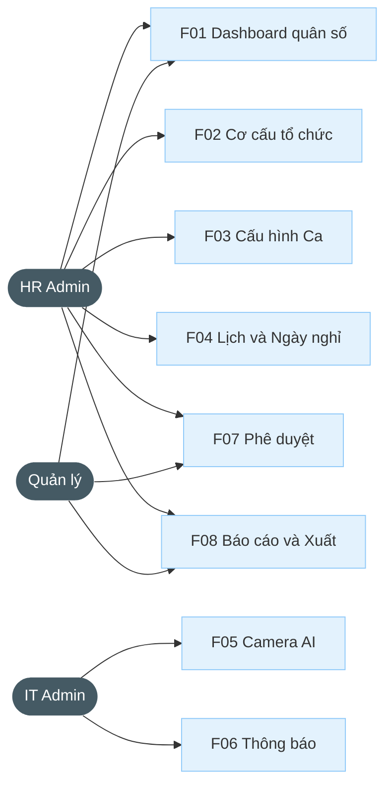

# BRD HR (Admin)

---

| Thông tin | Nội dung |
| --- | --- |
| Target release | Version 1.0 |
| Epic | STRATOS-ADMIN: Hệ thống Quản trị & Cấu hình tập trung |
| Document owner | ndthuy1 |
| Stakeholder | CEO, HR Admin, IT |
| Status | Open |

### **1. MỤC TIÊU**

- **Lý do tồn tại:** Doanh nghiệp cần công cụ quản lý nhân sự tập trung, thay thế các phương thức thủ công.
- **Bài toán:** Giải quyết việc cấu hình ca làm việc phức tạp (ca đêm, ca hành chính), quản lý thiết bị AI Camera và phê duyệt yêu cầu từ nhân viên trên một nền tảng duy nhất.
- **Giá trị mang lại:** Tự động hóa dữ liệu chấm công, tăng tính minh bạch và cung cấp báo cáo quản trị tức thời.

### **2. MÔ TẢ QUY TRÌNH NGHIỆP VỤ**

### **3. NHU CẦU NGƯỜI DÙNG**

| Persona | Nhu cầu cụ thể | Tài liệu |
| --- | --- | --- |
| HR | Cần quản lý camera điểm danh và cài đặt quy tắc bắn thông báo login fail/muộn sớm. | Cấu hình camera & Notification |
| Quản lý | Xem báo cáo tổng hợp quân số theo phòng ban để nắm bắt tình hình đi làm thực tế. | Dashboard Admin |
| HR Admin | Thiết lập các ca làm dự kiến và giờ nghỉ để hệ thống tính công tương ứng. | Quản lý Ca làm việc |

### **4. USE CASE**

### **5. PHẠM VI CHỨC NĂNG**

| Mã | Chức năng | Mô tả | User Story |
| --- | --- | --- | --- |
| F01 | Màn hình chính | Số lượng nhân viên (On-site/WFH/Vắng). Biểu đồ chuyên cần hằng ngày. | Là Manager, tôi muốn xem nhanh danh sách nhân viên trong ngày. |
| F02 | Cơ cấu tổ chức | View danh sách NV: ID, Phòng ban, Giờ check-in cuối và trạng thái hiện tại. | Là HR, tôi muốn biết ai đang hiện diện thực tế tại VP. |
| F03 | Cấu hình Ca | Thiết lập In/Out/Break. Case: Ca đêm (Crossing 00:00). Case: Punch limit. | Là Admin, tôi muốn tạo ca làm việc linh hoạt. |
| F04 | Lịch & Ngày nghỉ | Quản lý nghỉ lễ & nghỉ chính sách (Nghỉ sinh nhật, hạn mức WFH). | Là Admin, tôi muốn quản lý lịch nghỉ lễ toàn công ty. |
| F05 | Cấu hình Camera | Chọn Device ID từ C-Cam. Gán mục đích In/Out cho từng Camera. | Là IT, tôi muốn chọn camera sảnh làm máy chấm công. |
| F06 | Cấu hình Thông báo | Cấu hình cho 36 sự kiện. Chọn Policy (Gom tin/Chống nhiễu/Lập lịch). | Là Admin, tôi muốn nhận cảnh báo security tức thời. |
| F07 | Trung tâm Phê duyệt | Xử lý tập trung đơn Nghỉ/OT/Giải trình/Đổi ca từ nhân viên. | Là Quản lý, tôi muốn duyệt đơn nhanh gọn trên mobile. |
| F08 | Báo cáo & Xuất | Kết xuất Excel: Payroll chuẩn, Báo cáo Tuân thủ, Báo cáo KPI tổng. | Là HR, tôi muốn xuất dữ liệu chuẩn để tính lương tháng. |
| F09 | Nhập chấm công thủ công | HR/Manager nhập mốc chấm công khi C-Vision lỗi hoặc NV từ chối biometric. Cần phê duyệt. | Là HR, tôi muốn nhập thủ công khi camera gặp sự cố. |
| F10 | Cấu hình chính sách phép | Thiết lập phép cơ bản, thâm niên, carryover, pro-rata. Batch recalculate balance toàn hệ thống. | Là HR, tôi muốn cấu hình chính sách phép phù hợp công ty. |
| F11 | Quản lý chi nhánh | CRUD site: Tên, Mã, Timezone, Ngày chốt công. Deactivate site khi thu hẹp quy mô. | Là Admin, tôi muốn quản lý chi nhánh trên hệ thống. |
| F12 | Nhật ký hoạt động (Audit Log) | Xem toàn bộ log hệ thống. Filter theo user, module, action, time range. Export CSV. | Là Admin, tôi muốn truy vết mọi thay đổi trong hệ thống. |
| F13 | Offboarding nhân viên | Quy trình tự động khi NV nghỉ việc: hủy đơn, freeze phép, deactivate camera, re-route approval. | Là HR, tôi muốn xử lý nghỉ việc nhanh gọn không bỏ sót. |

### **6. YÊU CẦU PHI CHỨC NĂNG**

- Giao diện web, tương thích trên cả web và mobile.
- Hỗ trợ tìm kiếm nhanh, không phân biệt hoa/thường/dấu.
- Role-based & attribute-based access (RBAC + ABAC) theo Phòng ban.
- Xuất dữ liệu định dạng Excel theo mẫu chuẩn.

### **7. ĐIỀU KIỆN GIẢ ĐỊNH**

- Người dùng đã đăng nhập vào hệ thống quản trị trung tâm.
- Thiết bị Camera AI đã hoạt động và stream được dữ liệu ID về Server.

---
